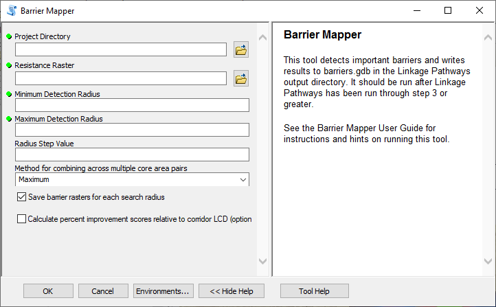
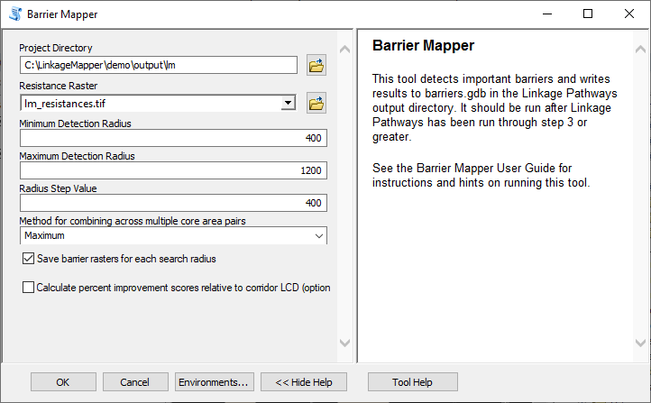
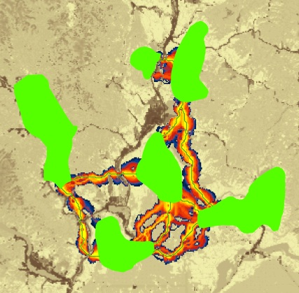
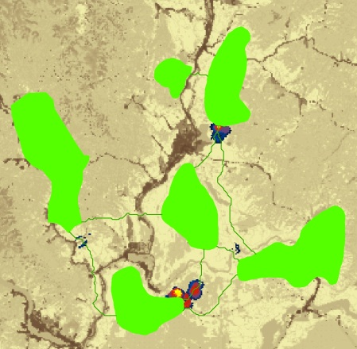
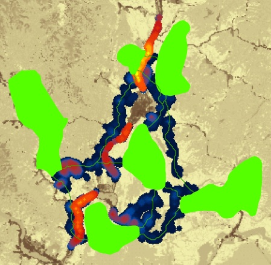

.. _bm:

***********************
Barrier Mapper
***********************

**Barrier Mapper User Guide**

*Version 3.0—Updated July 2021*

Brad McRae

The Nature Conservancy

**Acknowledgements**

Barrier Mapper builds on much of the Python code developed with **Darren
Kavanagh** for Linkage Mapper. I am grateful for Darren’s excellent
contributions.

**Software Requirements and Licensing**

Barrier Mapper requires **ArcGIS Desktop** (10.3 or greater) or **ArcGIS
Pro,** with the **ArcGIS Spatial Analyst** extension. This software is
provided free of charge and is licensed under a GNU General Public
License.

**Preferred Citation**

McRae, B.H. 2012. Barrier Mapper Connectivity Analysis Software. The
Nature Conservancy, Seattle WA. Available at
https://circuitscape.org/linkagemapper/.

**Table of Contents**

`1 Introduction <#introduction>`__

`2 Installation <#installation>`__

`3 Using Barrier Mapper <#using-barrier-mapper>`__

`3.1 Input data requirements <#input-data-requirements>`__

`3.2 Running the toolbox <#running-the-toolbox>`__

`3.3 What Barrier Mapper does <#what-barrier-mapper-does>`__

`4 Barrier Mapper tutorial <#barrier-mapper-tutorial>`__

`5 Community <#community>`__

`6 Literature cited <#literature-cited>`__

Introduction
============

Barrier Mapper is part of the Linkage Mapper toolbox, which includes the
Linkage Pathways Tool (McRae and Kavanagh 2011) and other modules
designed to support regional wildlife habitat connectivity analyses.
Once corridors have been mapped using Linkage Pathways, Barrier Mapper
detects important barriers that affect the quality and/or location of
the corridors. Results are written to the Linkage Pathways output
directory.

More details on the theory behind this approach can be found in McRae et
al. (2012).

Installation
============

**1) Install the latest version of Linkage Mapper**

Follow the instructions in the Linkage Pathways Tool User Guide to
install the toolbox.

**2) Verify your installation**

You can test the code by running the tutorial below.

Using Barrier Mapper
====================

Input data requirements
-----------------------

Barrier Mapper should be run after Linkage Pathways has been run through
step 3 or greater (see the McRae and Kavanagh 2011). Inputs to Barrier
Mapper include 1) the same resistance raster used in Linkage Pathways
and 2) CWD rasters generated from a completed Linkage Pathways run.
These rasters are located in the datapass directory, but you only need
to provide the project directory for Barrier Mapper to find them.

Running the toolbox
-------------------

   |image1|\ *Note: ArcGIS can be finicky about file locks. If you get
   schema lock or permission errors, you may need to close any active
   ArcGIS processes and start fresh without any output files displayed.*

   |image2|\ *Note: Several users have reported that they experience
   fewer ArcGIS Desktop errors when running from ArcCatalog.*\ **We
   therefore suggest you run from ArcCatalog if you are having problems
   with ArcMap.**

   |image3|\ *Note: Please ensure that your resistance and core area
   maps are in the same projection. These tools have not been tested
   with data in different coordinate systems.*\ **We strongly suggest
   that map units be in meters.**

Click on the *Barrier Mapper* tool, which is located in the *Additional
Tools* toolset in the *Linkage Mapper* toolbox. The following dialog
should appear.

Figure 1. Barrier Mapper dialog in ArcGIS Desktop.

A. **Input data**

   a. **Project directory:** Use the same project directory used for the
      Linkage Pathways run.

   b. **Resistance raster:** Use the same resistance raster used to
      create corridors using Linkage Pathways.

B. **Options**

   a. **Minimum detection radius:** Enter the minimum search radius for
      moving window analysis in map units. This is half the minimum
      length of a strip of land that could be restored, and must be
      greater than or equal to resistance raster cell size.

..

   |image4|\ *Note: barrier detection radii should be larger than the
   cell size. Also, radii that are close to the cell size can produce
   results that exaggerate improvement scores due to rounding error.*

b. **Maximum detection radius:** Enter the maximum search radius for
   moving window analysis. This is half the maximum length of a strip of
   land that could be restored. If you only want to search at a single
   radius, enter the same value as you did for the minimum radius.

c. **Radius step value:** Enter the increment in radius for each
   progressive window size. The difference in minimum and maximum radius
   should be divisible by this number. For example, a minimum of 100, a
   maximum of 500, and a step value of 200 would detect barriers at
   radii of 100, 300, and 500 map units. If you only want to search at a
   single radius, enter 0.

d. **Method for combining across multiple core area pairs:** when
   there’s more than one core area pair to connect, Barrier Mapper needs
   to combine results into a single map. It can do this one of two ways:

..

   *Maximum*: each pixel value will be set to the maximum improvement
   score taken across all core area pairs. Results will be written to
   barriers.gdb.

   *Sum:* each pixel value will be set to the sum of improvement scores
   taken across all core area pairs. This gives a measure of 'barrier
   centrality.' Note that choices made in earlier Linkage Pathways run
   (adjacency, maximum corridor length, dropping corridors that pass
   through intermediate core areas) will limit the number of corridors
   that can be affected by restoration of a cell. Results will be
   written to barriers_sum.gdb.

e. **Write barrier rasters for each search radius:** If checked, barrier
   rasters will be saved for each search radius when analyses are run
   across multiple radii. If unchecked, only rasters summarizing results
   across search radii will be saved.

f. **Calculate percent improvement scores relative to corridor LCD:** If
   checked, additional rasters calculating improvement score as a
   percentage of corridor least-cost distance (LCD) will be written.
   These will have 'Pct' in the raster name, and will have higher scores
   for corridors where the unrestored LCD is low, presumably meaning
   they are more viable to begin with.

What Barrier Mapper does
------------------------

Barrier Mapper implements the methods described in McRae et al. (2012)
using a circular search window. Results give expected reduction in
least-cost distance (LCD) **per unit distance restored** assuming pixels
in the window are changed to a resistance of **1.0**.

Outputs rasters will be written to barriers.gdb and/or barriers_sum.gdb
in your output directory. Output rasters are named using the following
convention:

<Project directory name>_<attributes>

**Attributes include:**

**BarrierCenters:** Improvement scores are mapped at the center pixel
for the search window.

**BarrierCircles:** Improvement scores are expanded to fill the entire
search window. For overlapping windows, the maximum value at each pixel
will be shown.

**Sum:** When there is more than one patch pair, the improvement score
at any pixel represents the sum of improvement scores, rather than the
maximum, across patch pairs.

**Pct:** Improvement scores are expressed in terms of percentage
improvement relative to original LCD (cost-weighted length) of corridor.

**RadX:** Results for search radius X.

**RadXToYStepZ:** Results summarized across search radii, from minimum
search radius *X* to maximum *Y* with step intervals of *Z*. For
example, a raster with an attribute of ‘Rad90To360Step90’ combines
results from 90, 180, 270, and 360 m barrier analyses.

Barrier Mapper tutorial 
=======================

After running the Linkage Pathways tutorial described in the Linkage
Pathways Tool User Guide (McRae and Kavanagh 2011), you can analyze
barriers in your output corridors. Open up *LM Demo Results.mxd* or the
*LM Results* map in *ArcGIS Pro Demo.aprx*, and run Barrier Mapper using
the following settings (substitute the path to your own demo directory).

Figure 2. Tutorial settings. If applicable, substitute the input for the
*Project Directory* parameter with the path to your demo project
directory.

These settings will map barriers at 400, 800, and 1200 m and will
summarize them across scales using both maximum and sum methods
described above. Figure 3 shows results for barriers detected at the
1200 m search radius, and Figure 4 shows results combined across the 3
search radii. In Figure 4, results from both maximum and sum methods are
shown. Note that these results are similar except for small differences
(as indicated by arrows in Fig. 4). Their similarity is due to the
settings used in the earlier Linkage Pathways tutorial run, which
restricted the number of corridors mapped so that there were few areas
affecting more than one corridor. As a result, restoring most pixels can
only improve one corridor.

Figure 3. A) corridors from Linkage Pathways tutorial, with least-cost
paths shown in green (a total of 8 corridors were mapped). B)
lm_BarrierCenters_Rad1200, which shows improvement scores at the center
pixel for 1200m radius search window locations. Least-cost paths are
shown for reference. C) lm_BarrierCircles_Rad1200, which shows same but
improvement with scores expanded to fill the entire search window, with
maximum score taken for overlapping windows.

Figure 4. Results showing composite of barriers across 400, 800, and
1200 m window sizes. A) lm_BarrierCircles_Rad400To1200Step400, showing
maximum per-meter improvement score mapped across search windows. B)
lm_BarrierCircles_Sum_Rad400To1200Step400, in which improvement scores
are summed across patch pairs at each scale before taking the maximum
across scales. C) Difference between sum and maximum methods (greatest
differences shown in yellow and do not exceed a ∆LCD of 1.5 meters **per
meter restored**). Results from taking the maximum per-meter improvement
score and sum of scores mapped among pairs are very similar, with most
significant differences in two areas where different corridors are in
close proximity.

Figure 5 shows results of a second Linkage Pathways run with less
restrictive settings. In this scenario, there were no limitations on
maximum corridor length and corridors were allowed to pass through
intermediate core areas (i.e. the box to drop corridors that intersect
core areas in step 3 was not checked). With these settings, an
additional 2 corridors were mapped (Fig. 5A). Because there are more
cases in which corridors occur in close proximity to one another, there
are more areas where restoration could improve multiple corridors. As a
result, there are more substantial differences between maximum and sum
methods. These differences show where a single restoration could improve
multiple corridors.

Figure 5. Linkage and barrier analysis with more core areas connected
(no distance cutoffs and corridors were allowed to pass through
intermediate core areas). A) corridors, with least-cost paths shown in
green (a total of 10 corridors were mapped). B) composite of barriers
across 400, 800, and 1200 m window sizes, with maximum per-meter
improvement score mapped across search windows (analogous to Fig. 4A).
C) same as upper right, except improvement scores are summed across
patch pairs (analogous to Fig. 4B). D) difference between maximum and
sum results, with greatest differences in yellow (maximum ∆LCD **per
meter restored** = 42.6). There are more substantial differences between
the maximum and sum methods here than in Fig. 4 because there are more
areas where multiple corridors could be improved through restoration of
a single area.

Community
=========

Please join the Linkage Mapper Google Groups forum at
https://groups.google.com/g/linkage-mapper to get updates, report bugs,
and suggest enhancements. Please also visit the project website at
https://circuitscape.org/linkagemapper/.

To contribute to the development of Linkage Mapper explore our code
repository on GitHub: https://github.com/linkagescape/linkage-mapper.

Literature cited
================

McRae, B.H., S.A. Hall, P. Beier and D.M. Theobald. 2012. Where to
restore ecological connectivity? Detecting barriers and quantifying
restoration benefits. PLoS ONE 7(12): e52604.
doi:10.1371/journal.pone.0052604

McRae, B.H. and D.M. Kavanagh. 2011. Linkage Mapper Connectivity
Analysis Software. The Nature Conservancy, Seattle WA. Available at:
https://circuitscape.org/linkagemapper.

.. |image1| image:: bm/image1.jpeg
   :width: 0.3125in
   :height: 0.32292in
.. |image2| image:: bm/image2.jpeg
   :width: 0.47014in
   :height: 0.47153in
.. |image3| image:: bm/image1.jpeg
   :width: 0.3125in
   :height: 0.32292in
.. |image4| image:: bm/image1.jpeg
   :width: 0.3125in
   :height: 0.32292in
