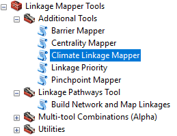
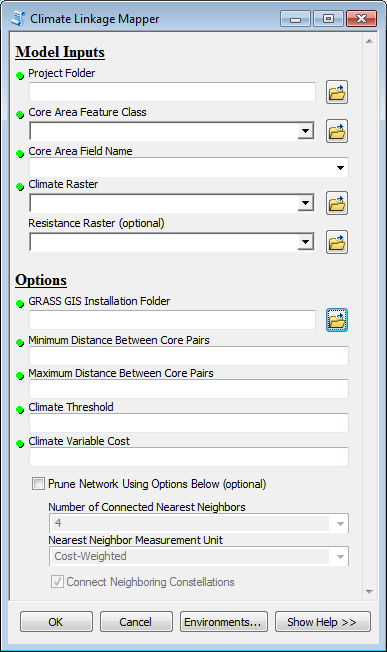
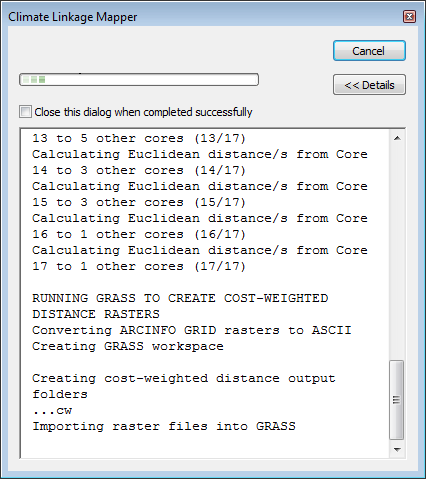
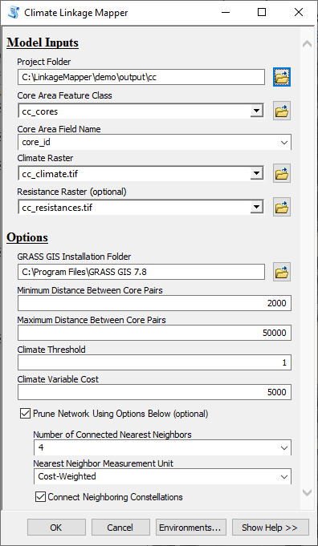

.. image:: cc/image1.tiff
   :alt: TIFF Climate_Report_Figure_3 2011JULY03.tif
   :width: 2.16667in
   :height: 2.19157in

Climate Linkage Mapper User Guide

**Linkage Mapper Toolbox:**

**Climate Linkage Mapper User Guide**

*Version 3.0—Updated July 2021*

Darren Kavanagh\ :sup:`1`, Tristan Nuñez :sup:`2`, and Brad
McRae\ :sup:`3`

:sup:`1`\ Torilis, LLC

:sup:`2`\ University of California, Berkeley

:sup:`3`\ The Nature Conservancy

**Acknowledgements**

Climate Linkage Mapper builds upon the Python code developed by Tristan
Nuñez as part of his master’s work (Nuñez 2011, Nuñez et al. 2013). We
are grateful to our collaborators in the Climate Change Subgroup of the
Washington Wildlife Habitat Connectivity Working Group for their
feedback and assistance, and to Jenny McGuire for testing and suggesting
improvements to the user guide.

**Software Requirements and Licensing**

Climate Linkage Mapper only runs on Microsoft Windows platforms. It
requires **ArcGIS Desktop** (10.3 or greater with Advanced license) or
**ArcGIS Pro** (Advanced license), with the **ArcGIS Spatial Analys**\ t
extension and **GRASS GIS**. This software is provided free of charge
and is licensed under a GNU General Public License.

**Preferred Citation**

Kavanagh, D.M., T.A. Nuñez, and B.H. McRae. 2013. Climate Linkage Mapper
Connectivity Analysis Software. The Nature Conservancy, Seattle WA.
Available at: https://circuitscape.org/linkagemapper/.

**Table of Contents**

`1 Introduction 3 <#introduction>`__

`2 Installation 3 <#installation>`__

`3 Using Climate Linkage Mapper 3 <#using-climate-linkage-mapper>`__

`3.1 Input data requirements 3 <#input-data-requirements>`__

`3.2 Running from a Python Script 5 <#running-from-a-python-script>`__

`3.3 Processing Steps 6 <#processing-steps>`__

`4 Climate Linkage Mapper DEMO 7 <#climate-linkage-mapper-demo>`__

`5 Extra hints 7 <#extra-hints>`__

`5.1 Background processing on ArcGIS Desktop
7 <#background-processing-on-arcgis-desktop>`__

`5.2 Changing linkage rules without re-starting from scratch
7 <#changing-linkage-rules-without-re-starting-from-scratch>`__

`6 Community 8 <#community>`__

`7 Literature cited 8 <#literature-cited>`__

Introduction
============

Climate Linkage Mapper is part of the Linkage Mapper toolbox, which
includes the Linkage Pathways Tool (McRae and Kavanagh 2011) and other
modules designed to support regional wildlife habitat connectivity
analyses. The tool is designed to create linkages between designated
core areas that fall along a climatic gradient (e.g. temperature). More
details on climate corridor theory and approaches to modeling climate
corridors can be found in Nuñez (2011) and Nuñez et al. (2013),
Washington Wildlife Habitat Connectivity Working Group (WHCWG) (2011)
and WHCWG (2012).

Installation
============

**1) Download and Install Linkage Mapper**

Download and install the Linkage Mapper toolbox from
https://circuitscape.org/linkagemapper. Open the zip archive and place
the *toolbox* directory with all its contents on your computer. Place
the *demo* directory in a folder that has no spaces or special
characters in its path. To install the toolbox follow the instructions
in the Linkage Pathways User Guide (McRae and Kavanagh 2011), which is
also included in the download.

**2) Download and Install GRASS GIS**

Download GRASS GIS 7.8 from https://grass.osgeo.org/download/windows/.
To install run the downloaded installation file and follow the on-screen
instructions. Please insure that the GRASS application will start. If
you experience startup errors some solutions can found at
https://grasswiki.osgeo.org/wiki/WinGRASS_errors.

|image1|\ Using Climate Linkage Mapper
======================================

To start Climate Linkage Mapper select the *Linkage Mapper* toolbox (see
Figure 1) in ArcGIS, and click on *Climate Linkage Mapper*. The dialog
illustrated in Figure 2 should appear. A description of each parameter
follows below.

Input data requirements
-----------------------

A. **Model Inputs**

   a. **Project Folder:** This is the windows folder where the final
         output will be saved. It is also used by the tool to store
         temporary outputs. This folder should be in a shallow tree and
         have a short name (something like C:\ANBO), ideally on a local
         drive for optimum processing speed and reliably. The name of
         the directory will also be used as a prefix for final Linkage
         Pathways output files (e.g. ANBO_LCPs). There should be no
         spaces or special characters anywhere in the folder path.

   b. |image2|\ **Core Area Feature Class:** Enter the polygon feature
         class (e.g. shape file) that contains the core areas (the
         polygons that will be connected with linkages).

   c. **Core Area Field Name:** This drop-down list will list all
         attribute fields in the core feature class. The selected field
         must consist of positive integers < 9999 that uniquely identify
         unique core areas. FID and ID fields cannot be used. An easy
         way to create a new field is to open the attribute table, add a
         new integer field and use the field calculator to fill it with
         an expression like <NewField> = FID + 1.

   d. **Climate Raster:** Enter the climate (e.g. temperature) surface
         here. This can be in any standard raster format that ArcGIS
         accepts.

   e. **Resistance Raster** (optional)\ **:** To optionally incorporate
         other impediments to movement, in addition to climatic
         variability, a resistance raster can be entered here. See the
         Linkage Pathways Tool User Guide (McRae and Kavanagh 2011) for
         tips on creating a resistance raster.

B. **Options**

   a. **GRASS GIS Installation Folder:** For the tool to work correctly
         you must tell it where GRASS GIS is installed. On Windows 10
         (64-bit) the default folder is *C:\Program Files\GRASS GIS
         7.X.X*.

   b. **Minimum Distance Between Core Pairs:** Enter the minimum
         edge-to-edge linkage distance that should separate one core to
         another. Linkages less than this distance will not be created.
         The distance unit is that of the input spatial layers.

   c. **Maximum Distance Between Core Pairs:** Enter the maximum
         edge-to-edge linkage distance that should separate one core to
         another. Linkages greater than this distance will not be
         created. The distance unit is that of the input spatial layers.
         **NOTE:** least-cost corridors can still be longer than this
         distance, as they will typically be considerably longer than
         the edge-to-edge distance between the core pairs they are
         connecting.

   d. **Climate Threshold:** A positive numeric value, in the same units
         as the climate raster, that limits core pairs based on climate.
         Core areas will only be connected if the difference between the
         lowest climate values is greater than the threshold. To avoid
         outliers, this value is two standard deviations below the mean
         of the core (see Nuñez 2011 and Nuñez et al. 2013 for more
         discussion on this topic).

   e. **Climate Variable Cost:** This is the distance to climate ratio,
         in cost-distance units per unit change in climate. It is used
         to calculate the anisotropic cost distance between cores. For
         example, 50000 is the appropriate value for a
         distance-to-temperature ratio of 50 km/1°C, where the map units
         are in meters (see Nuñez 2011 and Nuñez et al. 2013 for more
         discussion on this topic).

   f. **Prune Network Using Options Below (optional):** The number of
         corridors mapped can be optionally limited based on the
         following parameters. (This section is equivalent to Step 4 in
         the Linkage Pathways Tool).

      i.   **Number of Connected Nearest Neighbors:** The number of
              nearest neighbors to connect each core to. Any links that
              are not needed to connect each core to its N nearest
              neighbors are dropped. Allowable range is 1-4.

      ii.  **Nearest Neighbor Measurement Unit:** Choose whether to
              measure ‘nearest’ above in Euclidean or cost-weighted
              distance.

      iii. **Connect Neighboring Constellations:** If this option is
              selected links will be re-added to connect nearest pairs
              of core area ‘constellations’, i.e. discrete clusters of
              neighboring core areas, until all constellations are
              connected.

..

   |image3|\ *Please note that all input spatial layers should be in the
   same coordinate system. The tool assumes that they are. Furthermore,
   the spatial extent of the analysis will be the intersection of the
   input layers.*

Climate Linkage Mapper can be run once all the parameters are correctly
populated and the OK is pressed. Figure 4 in section 4 illustrates a
completed tool screen.

   |image4|\ *If you get a conflict between ArcGIS Desktop and GRASS,
   you should first try running Climate Linkage Mapper in the
   background. See section 5 below.*

Running from a Python Script
----------------------------

Climate Linkage Mapper can also be invoked programmatically outside of
ArcGIS Desktop or ArcGIS Pro, although there are many advantages in
running it within ArcGIS. The tool is written in Python and can be
initiated by calling *cc_main.py* (in the Linkage Mapper *scripts*
folder) with the appropriate input parameters. The Python script, *CC
Run Script.py*, in the Linkage Mapper *demo* folder gives an example
that can be modified to match your needs.

Processing Steps
----------------

|image5|\ To generate climate corridors Climate Linkage Mapper runs
through a series of computational steps. Some of these steps are logged
and reported in the tool’s *Details* window (see Figure 3). These can be
helpful in monitoring the tools progress and identifying problems. The
main steps are listed below along with a brief description of the action
they carrying out:

a) **Copy spatial data:** The tool copies the spatial inputs into the
   *clm_cor* folder within the project folder and, if necessary, reduces
   their extent.

b) **Calculate zonal statistics:** To get a statistical summary of
   climate values in each core area the tool calls ArcGIS’s *Zonal
   Statistics as Table* function.

c) **Create core pairing table:** A unique set of core to core pairings
   are created. For example, if you have 3 cores, you end up with 3 core
   pairings – (Core1-Core2, Core1-Core3, Core2-Core3).

d) **Limit cores based upon climate threshold:** The lowest mean values
   are calculated and core pairings with a mean difference lower than
   the threshold are removed.

e) **Limit cores based on Euclidean distances and create link table for
   Linkage Pathways:** Core pairs are next filtered by the minimum and
   maximum distance separating them. A Linkage Pathways link table is
   created along with the final core pairings.

f) **Run GRASS GIS to create cost-weighted distance rasters:** The
   anisotropic cost distance between the different core pairings are
   calculated using GRASS GIS’s r.walk function. As GRASS has its own
   unique spatial file structure, all inputs have to be imported into a
   temporary GRASS database.

g) **Run Linkage Pathways to create climate corridors:** Once all the
   cost distance rasters are generated, the tool calls Linkage Pathways
   to create the climate corridors. Linkage Pathways is started at *Step
   3*. Final output can be found in the *output* folder within the
   project folder\ **.** More details on Linkage Pathways outputs can be
   found in its user guide (McRae and Kavanagh 2011).

Four output files are maintained from steps *a* thru *f* – the core
feature class, the project resistance raster, the zonal statistics table
and the final core pairing table. These can be found within the
*clm_cor* folder. The project resistance raster will be named *projarea*
if no resistance raster was provided.

   |image6|\ *To change the number of nearest neighbors linked or to
   manually adjust the links mapped it is not necessary to re-run the
   tool as Linkage Pathways can be restarted independently at step 4.
   See section 5 below.*

Climate Linkage Mapper DEMO 
===========================

|image7|\ The Linkage Mapper download comes with sample data that can be
used to evaluate and test the Climate Linkage Mapper tool. The easiest
way to explore the demo data is to open the ArcGIS map document *CC
Demo.mxd* or the *CC Demo* map in *ArcGIS Pro Demo.aprx* in the Linkage
Mapper *demo* folder. To run the demo click on the Climate Tool and
enter the *Model Inputs* as illustrated in Figure 4 (substituting the
path to the installed *demo* folder and the GRASS GIS installation
folder). While the other options do not have to be followed, those
illustrated have been tested to generate output. The final output can be
reviewed in a separate map document - *CC Demo Results.mxd*. For more
information how to interpret Linkage Pathways outputs please see the
Linkage Pathways Tool user guide (McRae and Kavanagh 2011).

Extra hints
===========

Background processing on ArcGIS Desktop
---------------------------------------

Climate Linkage Mapper when running on ArcGIS Desktop executes best in
the background- this helps to avoid conflicts between ArcGIS and GRASS.
Right-click on the Climate Linkage Mapper tool shown in Figure 1, click
‘properties,’ and un-check ‘Always run in foreground.’ You will want to
show the Results window so that you can monitor program progress and
cancel runs (click Geoprocessing>>Results). The Results window also lets
you start new runs with the same settings used earlier runs.

Changing linkage rules without re-starting from scratch
-------------------------------------------------------

To change the number of nearest neighbors linked or to manually adjust
the links mapped it is not necessary to re-run the tool as Linkage
Pathways can be restarted independently at step 4.

The spatial inputs for Linkage Pathways are stored in the *clm_cor*
folder within the project directory. See the Linkage Pathways Tool user
guide for instructions on starting at step 4 (be sure to un-check steps
1-3) and on manually removing or retaining links.

Community
=========

Please join the Linkage Mapper Google Groups forum at
https://groups.google.com/g/linkage-mapper to get updates, report bugs,
and suggest enhancements. Please also visit the project website at
https://circuitscape.org/linkagemapper/.

To contribute to the development of Linkage Mapper explore our code
repository on GitHub: https://github.com/linkagescape/linkage-mapper.

Literature cited
================

McRae, B.H. and D.M. Kavanagh. 2011. Linkage Mapper Connectivity
Analysis Software. The Nature Conservancy, Seattle WA. Available at:
https://circuitscape.org/linkagemapper.

Nuñez, T.A. 2011. Connectivity Planning to Facilitate Species Movements
in Response to Climate Change. Available at
https://waconnected.org/climate-change-analysis/.

Nuñez, T.A., J.J. Lawler, B.H. McRae, D.J. Pierce, M.B. Krosby, D.M.
Kavanagh, P.H. Singleton, and J.J. Tewksbury. 2013. Connectivity
planning to address climate change. Conservation Biology.

Washington Wildlife Habitat Connectivity Working Group (WHCWG). 2011.
Washington Connected Landscapes Project: Climate-Gradient Corridors
Report. Washington Departments of Fish and Wildlife, and Transportation,
Olympia, WA. Available at
https://waconnected.org/climate-change-analysis/.

WHCWG. 2012. Climate Gradient Corridor Report: Frequently Asked
Questions. Departments of Fish and Wildlife, and Transportation,
Olympia, WA. Available at
https://waconnected.org/climate-change-analysis/.

.. |image3| image:: cc/image5.png
   :width: 0.30556in
   :height: 0.31667in
.. |image4| image:: cc/image5.png
   :width: 0.30556in
   :height: 0.31667in

