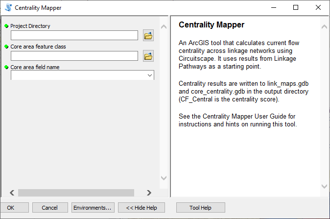
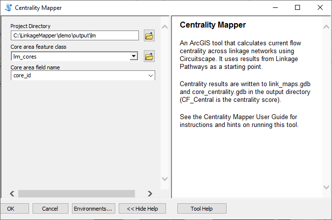
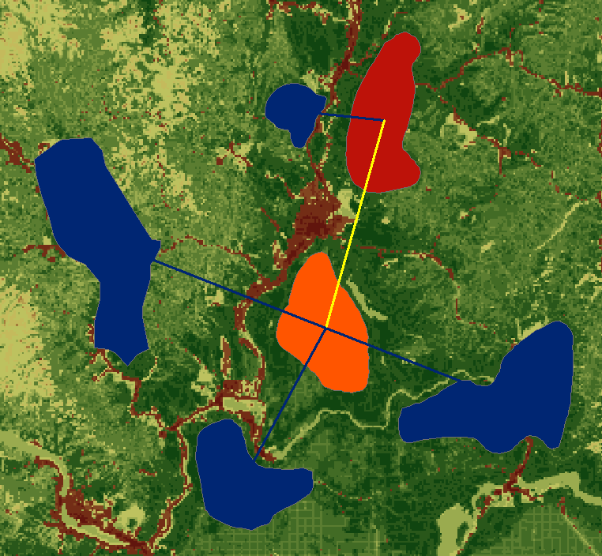

**Linkage Mapper Toolbox:**

**Centrality Mapper User Guide**

*Version 3.0—Updated July 2021*

Brad McRae

The Nature Conservancy

**Acknowledgements**

Centrality Mapper builds on much of the Python code developed with
**Darren Kavanagh** for Linkage Mapper, and uses Circuitscape, developed
with **Viral Shah.** I am grateful for Darren’s and Viral’s excellent
contributions.

**Software Requirements and Licensing**

Centrality Mapper requires **ArcGIS Desktop** (10.3 or greater) or
**ArcGIS Pro,** with the **ArcGIS Spatial Analyst** extension.
**Circuitscape 4** must also be installed on your machine. This software
is provided free of charge and is licensed under a GNU General Public
License.

**Preferred Citation**

McRae, B.H. 2012. Centrality Mapper Connectivity Analysis Software. The
Nature Conservancy, Seattle WA. Available at:
https://circuitscape.org/linkagemapper.

**Table of Contents**

`1 Introduction 2 <#introduction>`__

`2 Installation 2 <#installation>`__

`3 Using Centrality Mapper 2 <#using-centrality-mapper>`__

`3.1 Input data requirements 2 <#input-data-requirements>`__

`3.2 Running the toolbox 2 <#running-the-toolbox>`__

`3.3 What Centrality Mapper does 3 <#what-centrality-mapper-does>`__

`4 Centrality Mapper tutorial 4 <#centrality-mapper-tutorial>`__

`5 Community 5 <#community>`__

`6 Literature cited 6 <#literature-cited>`__

Introduction
============

Centrality Mapper is part of the Linkage Mapper toolbox, which includes
the Linkage Pathways tool (McRae and Kavanagh 2011) and other modules
designed to support regional wildlife habitat connectivity analyses.
Once corridors have been mapped using the Linkage Pathways, Centrality
Mapper analyzes the resulting linkage networks, calculating current flow
centrality across the networks. Current flow centrality is a measure of
how important a link or core area is for keeping the overall network
connected.

More details on centrality analyses can be found in Carroll et al.
(2012). More details on circuit theory and on Circuitscape software can
be found in McRae et al. (2008) and McRae and Shah (2009) respectively.

Installation
============

**1) Install the latest version of Linkage Mapper**

Follow the instructions in the Linkage Pathways User Guide to install
the toolbox.

**2) Install version 4 of Circuitscape**

Circuitscape 4 can be downloaded from
`circuitscape.org <https://circuitscape.org/>`__. If you are running
64-bit windows, make sure to install the 64-bit version.

**3) Verify your installation**

You can test the code by running the tutorial below.

Using Centrality Mapper
=======================

Input data requirements
-----------------------

Centrality Mapper uses the link maps (‘stick’ and least-cost path maps)
produced by Linkage Pathways and stored in the output directory, plus
the link tables saved in the datapass directory. You only need to
provide the project directory and the core area file.

Running the toolbox
-------------------

   |image1|\ *Note: ArcGIS can be finicky about file locks. If you get
   schema lock or permission errors, you may need to close any active
   ArcGIS processes and start fresh without any output files displayed.*

   |image2|\ *Note: Several users have reported that they experience
   fewer ArcGIS Desktop errors when running from ArcCatalog.*\ **We
   therefore suggest you run from ArcCatalog if you are having problems
   with ArcMap**

Click on the *Centrality Mapper* tool, which is located in the
*Additional Tools* toolset in the *Linkage Mapper* toolbox. The
following dialog should appear.

Figure 1. Centrality Mapper dialog in ArcGIS Desktop.

**Input data**

a. **Project directory:** Use the same project directory used for the
   Linkage Pathways run.

b. **Core area feature class:** Use the same core area file you used to
   create corridors using Linkage Pathways.

c. **Core area field name:** Use the same core area field name you used
   to create corridors using Linkage Pathways.

What Centrality Mapper does
---------------------------

Centrality Mapper reads in the vector outputs (least-cost path and stick
maps) from Linkage Pathways. It then calculates current flow centrality
on the linkage network using Circuitscape (McRae and Shah 2009). Each
core area is treated as a node, and each link is assigned a resistance
equal to the cost-weighted distance of the corresponding least-cost
corridor. Centrality Mapper then iterates through all core area pairs,
injecting 1 Amp of current into one core area and setting the other to
ground. It adds up the results across all core areas and links to
generate a centrality score.

Outputs are written to link_maps.gdb and core_centrality.gdb in your
output directory. The file names in link_maps.gdb are unchanged, but an
attribute is added to each link with a centrality score. A copy of the
core area feature class will be written to the core_centrality.gdb with
a centrality score attribute added.

Centrality Mapper tutorial 
==========================

After running the Linkage Pathways tutorial, you can analyze network
centrality on the linkage network it created. Open up *LM Demo
Results.mxd* or the *LM Results* map in *ArcGIS Pro Demo.aprx*, and run
Centrality Mapper using the following settings.

Figure 2. Tutorial settings. If applicable, substitute the input for the
*Project Directory* parameter with the path to your demo project
directory.

Figure 3. Tutorial outputs, found in link_maps.gdb and
core_centrality.gdb. Link colors indicate link centrality score (the
yellow link has a higher score than the others because its loss would
disconnect more than one core area from the rest of the network). Core
area colors indicate core area centrality; the orange core has the
highest centrality because it is a ‘hub’ for keeping the network
connected. The red core has a higher centrality score than the blue
cores because its loss would disconnect more than one core area from the
rest of the network.

Community
=========

Please join the Linkage Mapper Google Groups forum at
https://groups.google.com/g/linkage-mapper to get updates, report bugs,
and suggest enhancements. Please also visit the project website at
https://circuitscape.org/linkagemapper/.

To contribute to the development of Linkage Mapper explore our code
repository on GitHub: https://github.com/linkagescape/linkage-mapper.

Literature cited
================

Carroll, C., B.H. McRae, and A. Brookes. 2012. Use of linkage mapping
and centrality analysis across habitat gradients to conserve
connectivity of gray wolf populations in western North America.
*Conservation Biology* 26(1):78-87.

McRae, B.H., B.G. Dickson, T.H. Keitt, and V.B. Shah. 2008. Using
circuit theory to model connectivity in ecology, evolution, and
conservation. *Ecology* 10: 2712-2724.

McRae, B.H., and Shah, V.B. 2009. Circuitscape User’s Guide. ONLINE. The
University of California, Santa Barbara. Available at:
https://circuitscape.org.

Washington Wildlife Habitat Connectivity Working Group (WHCWG). 2010.
*Washington Connected Landscapes Project: Statewide Analysis.*
Washington Departments of Fish and Wildlife, and Transportation,
Olympia, WA. Available at: https://www.waconnected.org.

.. |image1| image:: cm/image1.jpeg
   :width: 0.3125in
   :height: 0.32292in

