**Linkage Mapper Toolbox:**

**Linkage Pathways Tool User Guide**

*Version 3.0—Updated July 2021*

Brad McRae\ :sup:`1` and Darren Kavanagh\ :sup:`2`

:sup:`1`\ The Nature Conservancy

:sup:`2`\ Adze Informatics

**Acknowledgements**

Brian Cosentino made substantial coding contributions to early versions
of this toolbox. Viral Shah contributed code from his thesis for network
analyses. Jeff Jenness supported this work with updates to the Conefor
Inputs tool. Thanks to Andrew Gilmer and Theresa Nogeire for helpful
comments on this user guide. Thanks also to the Washington Habitat
Connectivity Working Group for feedback on these tools as they were
being developed. John Gallo and Randal Greene made minor changes such as
terminology and screengrab updates for the v2.0 Release.

**Software Requirements and Licensing**

Linkage Mapper requires **ArcGIS Desktop** (10.3 or greater) or **ArcGIS
Pro**, with the **ArcGIS Spatial Analyst** extension. If you are using
ArcGIS Desktop and do not have an Advanced license, you will also need
to install the Conefor Inputs tool (see below). Linkage Mapper is
provided free of charge and is licensed under a GNU General Public
License.

**Preferred Citation**

McRae, B.H. and D.M. Kavanagh. 2011. Linkage Mapper Connectivity
Analysis Software. The Nature Conservancy, Seattle WA. Available at:
https://circuitscape.org/linkagemapper.

|brown_core_resistances_nolabel| |brown_linkages|

**Table of Contents**

`1. Introduction 3 <#introduction>`__

`1.1 Background 3 <#background>`__

`1.2 Before you begin– a note about connectivity modeling and software
limitations
3 <#before-you-begin-a-note-about-connectivity-modeling-and-software-limitations>`__

`2 Installation 4 <#installation>`__

`3 Using Linkage Pathways 5 <#using-linkage-pathways>`__

`3.1 Input data requirements 5 <#input-data-requirements>`__

`3.2 Prepping your data and work spaces
5 <#prepping-your-data-and-work-spaces>`__

`3.3 Running the toolbox 7 <#running-the-toolbox>`__

`4 What the Steps Do 10 <#what-the-steps-do>`__

`Step 1: Identify adjacent (neighboring) core areas
11 <#step-1-identify-adjacent-neighboring-core-areas>`__

`Step 2: Construct a network of core areas using adjacency and distance
data
11 <#step-2-construct-a-network-of-core-areas-using-adjacency-and-distance-data>`__

`Step 3: Calculate cost-weighted distances and least-cost paths
12 <#step-3-calculate-cost-weighted-distances-and-least-cost-paths>`__

`Step 4: Implement optional rules specifying which core area to connect
14 <#step-4-implement-optional-rules-specifying-which-core-area-to-connect>`__

`Step 5: Calculate least-cost corridors and mosaic them into a single
map
14 <#step-5-calculate-least-cost-corridors-and-mosaic-them-into-a-single-map>`__

`5 Other features, extra hints, and troubleshooting
16 <#other-features-extra-hints-and-troubleshooting>`__

`5.1 Saving and re-loading run settings
16 <#saving-and-re-loading-run-settings>`__

`5.2 Scaling your resistance values
16 <#scaling-your-resistance-values>`__

`5.3 Applying Linkage Pathways to large study areas, large core areas,
or large numbers of core areas
16 <#applying-linkage-pathways-to-large-study-areas-large-core-areas-or-large-numbers-of-core-areas>`__

`5.4 Manually removing or retaining links
16 <#manually-removing-or-retaining-links>`__

`5.5 Freeing up disk space 16 <#freeing-up-disk-space>`__

`5.6 Combining Linkage Pathways and Circuitscape to prioritize
connectivity conservation
17 <#combining-linkage-pathways-and-circuitscape-to-prioritize-connectivity-conservation>`__

`5.7 Common problems 17 <#common-problems>`__

`5.8 Recovering if ArcGIS applications crash in Step 3
17 <#recovering-if-arcgis-applications-crash-in-step-3>`__

`5.9 Helpful utilities and accessing additional options
18 <#helpful-utilities-and-accessing-additional-options>`__

`5.10 Upgrading 18 <#upgrading>`__

`6 Community 18 <#community>`__

`7 Literature Cited 18 <#literature-cited>`__

`8 Linkage Pathways Tutorial 19 <#linkage-pathways-tutorial>`__

Introduction
============

Background
----------

The Linkage Pathways Tool of the Linkage Mapper Toolbox is a GIS tool
designed to support regional wildlife habitat connectivity analyses. It
consists of several Python scripts, packaged as an ArcGIS tool, that
automate the mapping of wildlife habitat corridors.

Linkage Pathways uses vector maps of core habitat areas and raster maps
of resistance to movement to identify and map least-cost linkages
between core areas. Each cell in a resistance map is attributed with a
value reflecting the energetic cost, difficulty, or mortality risk of
moving across that cell. Resistance values are typically determined by
cell characteristics, such as land cover or housing density, combined
with species-specific landscape resistance models. As animals move away
from specific core areas, cost-weighted distance analyses produce maps
of total movement resistance accumulated.

The scripts use ArcGIS and Python functions to identify adjacent
(neighboring) core areas and create maps of least-cost corridors between
them. The scripts then normalize and mosaic the individual corridor maps
to create a single composite corridor map. The result shows the relative
value of each grid cell in providing connectivity between core areas,
allowing users to identify which routes encounter more or fewer features
that facilitate or impede movement between core areas.

We developed these scripts to support the 2010 Washington Wildlife
Habitat Connectivity Working Group (WHCWG) statewide connectivity
analysis, and public them public for use in other wildlife connectivity
assessments. More details on the models and algorithms implemented by
Linkage Pathways can be found in Chapter 2 and Appendix D of WHCWG
(2010).

**Enhanced Modules–**\ The toolbox now includes newly developed tools to
map pinch-points within corridors (using Circuitscape) , map core areas
and corridors with high network centrality (i.e. those that are most
important for keeping a network connected), map barriers (some of which
may offer restoration opportunities), the relative priority among all
the linkages on a landscape, and map corridors that follow climatic
gradients to facilitate species range shifts in response to climate
change. Please see the **Pinchpoint Mapper**, **Centrality Mapper**,
**Barrier Mapper, Linkage Priority**, and **Climate Linkage Mapper**
user guides included with the Linkage Mapper download.

Before you begin– a note about connectivity modeling and software limitations
-----------------------------------------------------------------------------

Linkage Pathways was developed to automate some of the arduous and
time-consuming steps of connectivity modeling. However, even with tools
like this one, *connectivity modeling involves a great deal of research,
data compilation, GIS analyses, and careful interpretation of results.*
Defining core areas, parameterizing resistance models, and other
modeling decisions you will need to make are not trivial. Before diving
in, we strongly recommend that users thoroughly familiarize themselves
with the process and challenges of connectivity modeling by consulting
published resources. Good places to start include an overview of habitat
and corridor modeling on the Corridor Designer website
(http://corridordesign.org/designing_corridors), WHCWG (2010), Beier et
al. (2011), and references listed within. See Sawyer et al. (2011) for a
critique of current corridor modeling practices.

You can see WHCWG (2010) for the kind of datasets for which Linkage
Pathways was developed and tested. You may encounter bugs or limitations
applying it different datasets, especially study areas with large
numbers of grid cells, large numbers of core areas, or core areas with
highly complex shape.

Installation
============

1) **Make sure you have the required GIS and Python installations**

Linkage mapper requires **ArcGIS Desktop** (10.3 or greater) **or ArcGIS
Pro,** with **ArcGIS Spatial Analyst**. You will also need **Python**
and **NumPy** (Numerical Python), which are automatically installed by
ArcGIS.

2) **Install Linkage Mapper**

Download **Linkage Mapper from** https://circuitscape.org/linkagemapper.

Open the linkagemapper.zip archive and place the contents in a folder
that has no spaces or special characters in its path (e.g.
C:\LinkageMapper).

3) **Install the Conefor Inputs Tool for ArcGIS (optional for users with
   ArcGIS Desktop Advanced or ArcGIS Pro)**

|image1|\ Download Conefor inputs from:
http://jennessent.com/arcgis/conefor_inputs.htm. Once you’ve downloaded
the tool, follow the instructions in the Conefor Inputs user guide. From
there, you’ll need to activate the Conefor toolbar in ArcMap:
View>>Toolbars>>Conefor. The toolbar should look like this:

4) **Verify your installation**

There are multiple ways to access the Linkage Mapper toolbox in ArcGIS.
The simplest method is to browse to the installation directory via a
catalog folder connection and double clicking the toolbox. For other
methods see the product help.

You can test the code by running the tutorial at the end of this
document.

Using Linkage Pathways 
======================

Input data requirements
-----------------------

Inputs to Linkage Pathways include 1) a core area polygon GIS file, 2) a
resistance raster GIS file, and, depending on your ArcGIS software or
license, 3) a text file specifying Euclidean (straight-line,
edge-to-edge) distances between core area polygons. The core area
polygon GIS file can be either an ESRI shapefile or ESRI geodatabase
feature class. The file must have an attribute specifying core area IDs
consisting of positive integers < 9999 that identify unique core areas.
The resistance raster GIS file should include resistances represented by
positive numbers (integers or floating point) only. We recommend
resistances scaled so that values of 1 represent ideal habitat (WHCWG
2010) and increase to at least 100 for barriers (Beier et al. 2011).

   |image2|\ *Please ensure that your resistance and core area maps are
   in the same projection. Linkage Pathways has not been tested with
   data in different coordinate systems.*\ **We strongly suggest that
   map units be in meters.**

The text file with Euclidean distances between cores can be generated by
the Conefor Inputs tool using the core area file as input (see next
section). It can also be automatically generated by Linkage Pathways if
you have ArcGIS Desktop Advanced or ArcGIS Pro.

Prepping your data and work spaces
----------------------------------

Before you start, you’ll need to set up your project directory and, if
necessary, create a Euclidean distances file using your core area
polygon data and the Conefor Inputs Tool.

**1) Create a project directory**

This is where intermediate and output files will be written. This should
be a shallow and short directory (something like C:\ANBO), ideally on a
local drive to speed processing. The name of the directory will also be
used as a prefix for final output files (e.g. ANBO_LCPs). There should
be *no spaces or special characters* anywhere in the directory path.

*Note: running Linkage Pathways with input data or project directories
on a shared drive can slow things down drastically, and can cause errors
with some ArcGIS routines. It’s best to use a local drive (and shallow
directory) if you can.*

|image3|\ *You should create unique project directories for each
project/scenario you run, to avoid confusing intermediate data from
different analyses.*

Several subdirectories will be created in your project directory,
including an *output* directory with final products. Data are passed
between computational steps in the *datapass* directory\ *.* The scripts
also create vector line maps with corridor statistics (stored in the
*datapass* directory between steps and the *link_maps* geodatabase in
the *output* directory when the program completes), as well as raster
corridor maps (stored in the *corridors* geodatabase). Step-by-step
versions of link maps are moved to *run_history* directory after
completion. This directory also has a *log* directory where run messages
are stored.

**2) If you don’t have an Advanced ArcGIS Desktop license or ArcGIS Pro,
calculate Euclidean (straight-line) distances between core areas using
the Conefor Inputs Tool.**

The Conefor Inputs Tool measures minimum Euclidean distances between
core area polygons. We use this tool solely to generate a text table of
core area pairs and distances between them. If you have another way to
provide a table of distances in the same format (see the demo data
provided in the tutorial), you may do that instead.

Conefor Inputs gives you the option to analyze either all core area
pairs or only those within a specified distance. Restricting analyses to
a specified distance is particularly useful when working with large
numbers of core areas for a specific species; if a species is only known
to disperse *X* map units, and you want to only map linkages that are
less than *X* in length, then using this cutoff can save calculation
time if you have hundreds or thousands of core areas.

|image4|\ *Don’t forget: if you modify your core polygon layer, be sure
to re-run Conefor Inputs with the new data.*

|image5|\ Start by clicking on the left toolbar button

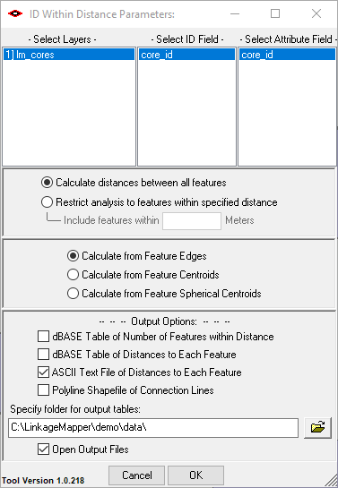

This window should appear.

-  Select your core area polygon file in the Layers column. Then, select
      a unique core area ID field in the **ID** and **Attribute** field
      columns.

-  Choose whether to calculate distances between all features or
      restrict your analyses to features within a specified distance
      (see above).

..

   |image6|\ *Note: If you restrict analyses to features within a
   specified distance, be sure to enter distances using the same units
   of measurement that are used in your GIS files.*

-  Select the option to calculate distances from the edges of features.

-  Have Conefor Inputs create an output file in text format by selecting
      **ASCII**.

-  Select a location to save the output file. You’ll need to browse to
      this file again later.

-  Click OK (Conefor may give you an error, but you can ignore it as
      long as you get a distance table in your output folder).

..

   .. image:: lm/image8.PNG
      :width: 1.67893in
      :height: 2in

   Text file created by Conefor Inputs showing Euclidean distances
   between core areas.

Running the toolbox
-------------------

   |image7|\ *Note: ArcGIS can maintain file locks even with it is done
   with a file. If you get schema lock or permission errors, you may
   need to close ArcGIS applications and start fresh without any output
   files displayed.*

   |image8|\ *Note: Several ArcGIS Desktop users have reported that they
   experience fewer ArcGIS errors when running from ArcCatalog.*\ **We
   therefore suggest you run from ArcCatalog if you are having problems
   with the tool in ArcMap.**

Click the *Linkage Pathways Tool* toolset of the *Linkage Mapper*
toolbox, and click on *Build Network and Map Linkages*. The following
dialog should appear in ArcGIS Desktop. Lettered items are described
below.

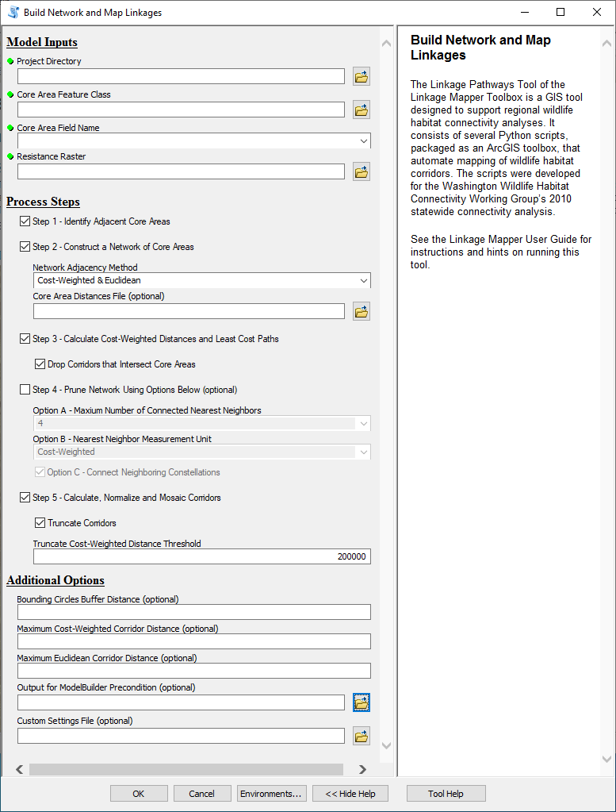

A. **Input Data**

   a. **Project Directory:** Enter the project directory for your
      analyses (described in section 3.2 above). You should create a
      different project directory for each unique project/scenario you
      run, to avoid confusing data from different analyses.

   b. **Core Area Feature Class:** This is your map of core habitat area
      polygons (the polygons you will be connecting with linkages).

..

   |image9|\ *Note: if you choose a feature class that is open in a map
   and any of the features are selected, Linkage Pathways will only
   operate on those features.*

c. **Core Area Field Name:** Field must consist of positive integers <
   9999 that identify unique core areas in your core area polygon file.

d. **Resistance Raster:** Enter the resistance raster for your project.

B. **Check the steps you want to complete.** You can check all steps to
   run from start to finish in one shot. You can also re-start failed or
   killed runs at any step in the process by checking only those steps
   you want to re-do. **Note:** Step 4 is optional. Check step 4 and
   fill in step 4 options if you want to only connect each core to its
   1-4 nearest neighbors and then connect clusters of cores together,
   rather than connecting all adjacent cores. Refer to Section 4 below
   for more details on what each step does.

C. **Step 1 - Identify Adjacent (neighboring) Core Areas**

D. **Step 2 - Construct a Network of Core Areas**

   a. **Network Adjacency Method:** Specify whether to create links
      between core areas that are adjacent in Euclidean and/or
      cost-weighted distance space. If you choose both, corridors will
      be mapped between core areas that are adjacent in Euclidean OR
      cost-weighted distance space.

   b. **Core Area Distances Text File:** Enter the distances text file
      generated by the Conefor Inputs tool (**users with ArcGIS Desktop
      Advanced or ArcGIS Pro can leave the field**\ **blank** and have
      Linkage Pathways create this file. This can be time consuming, so
      if you are re-running with the same core file, make sure to point
      to the text file Linkage Pathways created earlier (ending in
      “dists.txt”), which can be found in your project directory).

E. **Step 3 - Calculate Cost-Weighted Distances and Least-Cost Paths**

   a. **Drop Corridors that Intersect Core Areas:** This will take
      effect in step 3. See detailed description in Section 4 below.

F. **Step 4 - Prune Network**

You can limit the number of corridors mapped to those needed to ensure
that each core area is connected to its 1-4 nearest neighbors (and then
optionally connect any disjunct ‘constellations’ of core areas below).

   **Number of Connected Nearest Neighbors:** If step 4 is checked, this
   option lets you choose how many nearest neighbors to connect each
   core area to. Any links that are not needed to connect each core to
   its *N* nearest neighbors are dropped. Selecting “Unlimited” allows
   connections to all neighbors.

   **Nearest Neighbor Measurement Unit:** Choose whether to measure
   ‘nearest’ above in Euclidean or cost-weighted distance.

   **Connect Neighboring Constellations:** After links that are not
   needed to connect each core to its *N* nearest neighbors are dropped,
   this option allows you to re-add links connecting nearest pairs of
   core area ‘constellations,’ i.e., discrete clusters of neighboring
   core areas, until all constellations are connected.

G. **Step 5: Calculate, Normalize, and Mosaic Corridors**

   a. **Truncate Corridors:** When checked, create a copy of the
      project_corridors output, with cost-weighted distance values above
      the threshold value specified below converted to NoData.

   b. **Truncate Cost-Weighted Distance Threshold:** The threshold to
      use with the Truncate Corridors option above.

H. **Additional Options:**

   a. **Bounding Circles Buffer Distance (optional):** If a value is
      entered, this will create bounding circles around pairs of core
      areas (recommended for speed; see detailed description in Section
      4 below). Buffer distances are entered in map units, e.g. a 10 km
      buffer would be entered as 10000 if map units were in meters.
      Leave blank if you don’t want to use bounding circles.

   b. **Maximum Corridor Distances:** Maximum distances can speed up
      calculations by dropping excessively long corridors. If you are
      unsure, you should leave blank or overestimate. You can always
      make distances more stringent by re-running step 5. You can’t make
      them less stringent without going back to step 2.

      i.  **Maximum Cost-Weighted Corridor Distance (optional):** If you
          only want to map corridors that are less than a maximum
          cost-weighted corridor length, enter it here (in map units).
          This will take effect in steps 3-5.

      ii. **Maximum Euclidean Corridor Distance (optional):** If you
          only want to map corridors between core areas that are closer
          than a certain distance apart, enter it here (in map
          units)\ *.* This will take effect in steps 2-5. **NOTE:**
          least-cost corridors can still be longer than this distance,
          as they will typically be considerably longer than the
          edge-to-edge distance between the core pairs they are
          connecting.

   c. **Output for ModelBuilder Precondition (optional):** Create an
      optional output copy of the input cores, which can be used in
      ModelBuilder workflows to indicate that LP has finished
      processing.

   d. **Custom Settings File (optional):** An optional .py file to be
      used in place of lm_settings.py, which facilitates keeping all the
      settings needed to reproduce a scenario run.

What the Steps Do
=================

5) As described above, the Build Network and Map Linkages tool takes 1)
   a core area polygon map, 2) a resistance raster, and 3) a text file
   specifying Euclidean distances between core area polygons (if you
   have ArcGIS Desktop Advanced or ArcGIS Pro Linkage Pathways will
   generate this automatically). The tool then processes these data in 5
   steps, illustrated and described below:

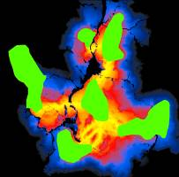

Step 1: Identify adjacent (neighboring) core areas
--------------------------------------------------

**Inputs:** core area polygon file and resistance raster file.

**Outputs:** text files listing adjacent core areas in Euclidean
(straight-line) and cost-weighted distance space (*euc_adj.csv* and
*cwd_adj.csv*).

Step 1 identifies adjacent core areas using the ArcGIS **Cost
Allocation** and **Euclidean Allocation** functions. Using your core
area polygons and resistance raster, ArcGIS creates raster files that
‘allocate’ grid cells to the nearest core area in either Euclidean space
or cost-weighted distance space. If a pathway from one core area to
another must pass through the allocation zone of a third, then the two
core areas are considered nonadjacent. For example, core areas *1* and
*6* below are not adjacent because it is impossible to move from one to
the other without at least passing through the allocation zone of core
areas *2, 4,* or *5*. This step creates a subdirectory named ‘\ *adj’*
within your project directory and stores rasters with data on adjacency
and distances there. Adjacency lists are stored in text files
*euc_adj.csv* and *cwd_adj.csv* within your *datapass* directory\ *.*

|image10| |image11| |image12|

Core areas, resistance surface, and allocation grids for Linkage
Pathways tutorial data. Left: core areas (green) and resistance surface
(lower resistances shown in lighter shades). Center: Euclidean
allocation zones, with different shades for each core area. Right:
cost-weighted distance allocation zones. In this example, core areas *1*
and *3* are adjacent in cost-weighted distance space, but not in
Euclidean space.

Step 2: Construct a network of core areas using adjacency and distance data
---------------------------------------------------------------------------

**Inputs:** core area polygon file, text file of distances produced by
Conefor Inputs (or Linkage Pathways), and core area adjacency files
(*euc_adj.csv* and/or *cwd_adj.csv*).

**Outputs:** text file describing network (*linkTable_s2.csv*), and
stick map showing links (*sticks_s2.shp*).

This step recognizes the text files specifying core area adjacency
(*euc_adj.csv* and *cwd_adj.csv*) created in step 1, as well as the
distances calculated using the Conefor Inputs tool or Linkage Pathways.
It uses these to create a “stick map” (*sticks_s2.shp*) connecting core
area pairs that are candidates for corridor mapping. This step also
generates *linkTable_s2.csv,* a table viewable in Microsoft Excel. This
table describes the network and keeps track of which links are active,
which are dropped, and statistics on each. These files are all stored in
your *datapass* directory, and are used and updated with new versions
(*linktable_s3.csv*, etc.) in subsequent steps. They are also saved in
your *run_history* directory for reference. This step allows you to
automatically discard links that are longer than a specified maximum
Euclidean distance.

|image13|\ “Stick Map” created in step 2 (stored in *run_history*
directory as *sticks_s2.shp*). Stick numbers show potential links
between adjacent core areas, and include information on each. In this
example, stick colors correspond to Euclidean (straight-line) distances
between polygon edges.

Step 3: Calculate cost-weighted distances and least-cost paths
--------------------------------------------------------------

**Inputs:** core area polygon file, resistance raster file,
*linkTable_s2.csv*.

**Outputs:** cost-weighted distance rasters for each core area (stored
in *cwd* directory), a single cost-weighted distance raster for all core
areas (*cwd*, stored in the *output* directory), *linkTable_s3.csv,
sticks_s3.csv, lcplines_s3.csv*.

Step 3 uses the core area polygons, resistance raster, and link table
from step 2 to perform cost-weighted distance calculations from each
core area. As each cost-weighted distance surface is created, Linkage
Pathways also extracts minimum cost-weighted distances between source
and target core area pairs.

Step 3 also maps least-cost paths (the route along which the least
resistance is accumulated) from core to core, using the cost-weighted
distance raster and a direction raster for each core area. This step
allows users to automatically discard linkages where the least-cost path
passes through an intermediate core area (see graphic below) or linkages
that are longer than a specified maximum cost-weighted or Euclidean
distance.

|brown_all_lcps_step3| |image14|

Least-cost paths between adjacent core areas (left). The red path
(right) passes through an intermediate core area- that link would be
dropped if the Drop Corridors that Intersect Core Areas box were
checked. Links that are too long in Euclidean or cost-weighted distance
can also be dropped automatically.

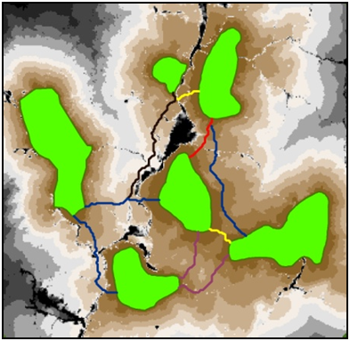

Step 3 places *cwd*\ **,** a raster showing the cost-weighted
distance to the nearest core area, in the *output* directory.
Least-cost path lines are attributed with various linkage statistics
(e.g. the total cost-weighted distance traversed by the linkage,
shown above).

*Minimizing processing time using the bounding circles option*

Using bounding circles can considerably speed up calculations. Linkage
Pathways first calculates bounding circles around “source” and “target”
core area pairs. The resistance layer is then clipped by the union of
all bounding circles for the source core area plus a buffer large enough
to allow corridors sufficient room to “roam.” For example, the graphic
below shows buffer distances of 10 km (entered as 10000 map units under
the Buffer Distance for Bounding Circles in the Additional Options
section of the toolbox). This limits cost-weighted distance calculations
from each source core to include only the portion of the landscape
likely to be relevant to connectivity between the sources and target
cores, reducing processing time.

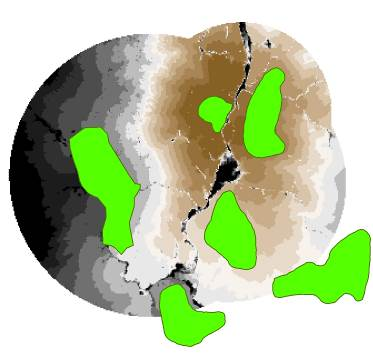

Bounding circles calculated for core area 2. Top: circles encompass core
area *2* and each respective ‘target’ core area (*1*, *3*, and *5*) plus
a buffer distance. Bottom left: for cost-weighted distance calculations
from any core area, the algorithm extracts the portion of the resistance
layer that falls within the union of all circles containing that core
area. Bottom right: cost-weighted distance calculated from core area
*2*.

   |image15|\ *Note: If you’re unsure of an appropriate buffer distance,
   we recommend using a large value or skipping entirely. However, be
   aware that for large datasets with hundreds of core areas, the
   processing time can add up fast.*

Step 4: Implement optional rules specifying which core area to connect
----------------------------------------------------------------------

**Inputs:** *linkTable_s3.csv, lcplines_s3.shp.*

**Outputs:** *linkTable_s4.csv, sticks_s4.shp, lcplines_s4.shp.*

Step 4 optionally lets you connect each core area to just its 1-4
nearest neighbors, and then connect disjunct clusters (constellations)
if desired. The latter will connect clusters of core areas together,
starting with the closest, until all clusters are connected (as long as
they are within maximum corridor lengths, if specified). You can measure
‘nearest’ in either Euclidean or cost-weighted distance.

Here’s how step 4 alters the network when run with the option to connect
each core area to its nearest neighbor (Step 4 option A = 1) in
cost-weighted distance units and then connect disjunct constellations
(Step 4 option C). In this case, two constellations were formed, with
the two northernmost cores constituting one constellation and the
remaining four cores constituting the other. The link between core areas
*3* and *5* then connected the two constellations to form a single,
connected network.

Step 5: Calculate least-cost corridors and mosaic them into a single map
------------------------------------------------------------------------

**Inputs:** *linkTable_s4.csv or linkTable_s3.csv*; cost-weighted
distance rasters; *lcplines_s4.shp* (if present in *datapass* directory)
or lcplines_s3.shp.

**Outputs:** Final products including *linkTable_s5.csv*, (stored in the
*output* directory), and final linkage maps and least-cost path feature
classes (stored in *corridors.gdb* and *link_maps.gdb* in the *output*
directory).

Step 5 calculates least-cost corridors (the sum of cost-weighted
distance rasters calculated from each pair of core areas that are
connected). It also normalizes least-cost-corridors by subtracting the
least-cost path distance from the raw corridor:

*NLCC\ AB = CWD\ A* + *CWD\ B* – *LCD\ AB*

Where *NLCC\ AB* is the normalized least cost corridor connecting core
areas *A* and *B*, *CWD\ A*\ is the cost-weighted distance from core
area *A*, *CWD\ B* is the cost-weighted distance from core area *B*, and
*LCD\ AB* is the cost-weighted distance accumulated moving along the
ideal (least-cost) path connecting the core area pair. This step maps
all corridors in the same ‘currency;’ grid cells in each normalized
corridor raster range in value from 0 (the best or least-cost path) on
up. Cell values are still in cost distance units, and reflect how much
more costly the (locally optimal) path between the core areas passing
through each cell is relative to the (globally optimal) least-cost path
connecting the core area pair. As it calculates normalized corridors,
step 5 combines them into a single map using the ArcGIS Mosaic function
to create a composite linkage map in which each cell represents the
minimum value of all individual normalized corridor layers.

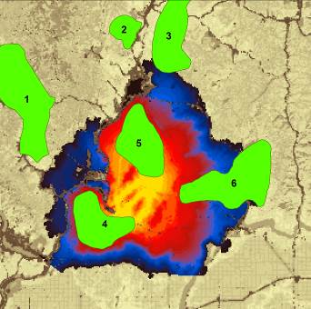

Compositing process for normalized least-cost corridors. Panels show
just two corridors as an example. Left and center panels show normalized
least-cost corridors connecting core area *4* to core areas *5* and *6*,
respectively. Colors indicate how much more costly the route between
core area pairs passing through each cell is relative to the least-cost
path connecting the core area pair. Linkage Pathways takes the minimum
value of all normalized corridors to create a composite map (right
panel).

This step also writes final stick and LCP maps, separated into active
and inactive sticks and LCPs. Inactive links are those that have been
dropped based on user criteria. It creates a final link table that only
includes active links. Final link tables have extra columns with
additional info, including *lcpLength* (the un-weighted length of the
least-cost path), *cwdToEucRatio* (the ratio of cost-weighted distance
to Euclidean distance between core areas), and *cwdToPathRatio* (the
ratio of cost-weighted distance to the un-weighted length of the
least-cost path, i.e. the distance traveled moving along the path).
Finally, this step creates geodatabase (*link_maps.gdb* and
*corridors.gdb*) in the *output* directory with final LCP and stick
feature classes and mosaicked least-cost corridor maps.

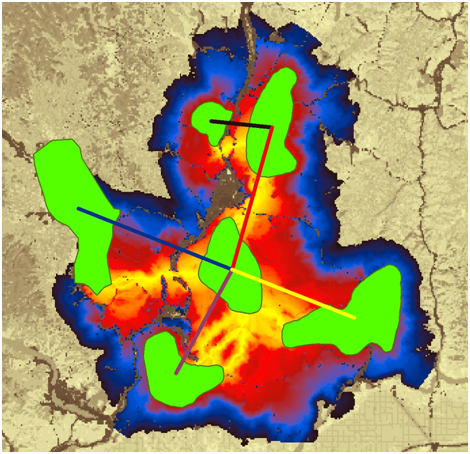

Normalized and mosaicked least cost corridors using the tutorial data
(saved in corridors.gdb). Yellow grid cells are closer to corridor
centers, with dark blue cells showing routes that accumulate up to 100km
cost-weighted distance more than the optimal (least-cost) route. Stick
colors show the ratio of cost-weighted distance to Euclidean distance
for each link (cwd2Euc_r field in the feature classes), a metric of
corridor quality. Yellow sticks show linkages that accumulate the least
cost per unit Euclidean distance between core areas, while black sticks
show linkages that accumulate the most.

Other features, extra hints, and troubleshooting
================================================

Saving and re-loading run settings
----------------------------------

ArcGIS automatically saves settings from previous runs, and you can
re-load them using the *Results* tab. See the relevant ArcGIS
application help for instructions. You can pick up a failed run (or
re-run starting from any step using different parameter choices) by
un-checking the steps prior to the one you wish to start at. No need to
delete output files; they will be automatically overwritten.

Scaling your resistance values 
------------------------------

Creating resistance and core area maps is the trickiest part of
connectivity analysis, and methods for doing this is beyond the scope of
this manual. However, you’ll find that it’s a good idea to set lowest
resistances to 1: that way the cost-weighted distance of moving through
‘ideal’ habitat is equal to Euclidean distance moved, and linkage
statistics become more meaningful because they can be compared against
values that would be expected in a fully connected landscape. We
typically recommend maximum resistances of at least 100, and users often
go to 1,000 or 10,000.

Applying Linkage Pathways to large study areas, large core areas, or large numbers of core areas
------------------------------------------------------------------------------------------------

Before applying Linkage Pathways to a large project or study area, we
recommend testing on a small area with a limited number of core areas.
This will help you get a feel for how Linkage Pathways works, and for
which parameter combinations will give you results that best meet your
objectives. Please note that large core areas can cause Linkage Pathways
to take take hours, or even days, to calculate Euclidean distances in
step 2. This is a limitation of the ArcGIS GenerateNearTable algorithm,
which we use to calculate distances between core areas.

Manually removing or retaining links
------------------------------------

Links can be manually removed by editing one of the *linkTable* files in
the *datapass* directory. For example, to remove a link before step 4
runs, edit *linkTable_s3.csv* and set the value for the link in the
‘linkType’ column to ‑100. Then run Linkage Pathways starting at step 4
by only checking Steps 4 and 5. Links with negative linkType values are
automatically discarded, and ‑100 is reserved for user-removed links.

To keep a link that would otherwise be dropped because of its Euclidean
or cost-weighted length, first run Linkage Pathways through step 3
without using a maximum distance. Then edit *linkTable_s3.csv* and set
the value for the link in the ‘linkType’ column to 100. You can then
apply maximum distances and they will be ignored for that link.

Freeing up disk space
---------------------

Linkage Pathways creates cost-weighted distance rasters for every core
area. This can take up very large amounts of disk space. To free up disk
space once you are satisfied with final results, you can delete the
*cwd* folder in your *datapass* directory (the **Delete CWD Rasters**
utility will do this for you). Once it’s deleted, you will need to
re-run step 3 if you want to generate new corridors with modified input
settings.

Combining *Linkage Pathways* and *Circuitscape* to prioritize connectivity conservation
---------------------------------------------------------------------------------------

Circuit theory can complement least-cost analyses and help to prioritize
important areas for connectivity conservation (McRae et al. 2008). The
**Pinchpoint Mapper tool** will automatically run Circuitscape within
Linkage Pathways outputs to get the best of both approaches, as
illustrated below (see the Pinchpoint Mapper user guide
|image16|\ included with the Linkage Mapper download).

Example of how circuit theory can be used to identify and prioritize
important areas for connectivity conservation. (A) Simple landscape,
with two patches to be connected (green) separated by a matrix with
varying resistance to dispersal (low resistance in white, higher
resistance in darker shades, and complete barriers in black). (B)
Least-cost corridor between the patches (lowest resistance routes in
yellow, highest in blue). (C) Current flow between the same two patches
derived using Circuitscape (McRae and Shah 2009), with highest current
densities shown in yellow (from McRae et al. 2008). Circuit analyses
complement least-cost path results by identifying important alternative
pathways and “pinch points,” where loss of a small area could
disproportionately compromise connectivity. (D) A promising application
is restricting circuit analyses to least-cost corridor slices to take
advantage of the strengths of both approaches. This hybrid approach
shows both the most efficient movement pathways and critical pinch
points within them, which glow yellow. These could be prioritized over
areas that contribute little to connectivity, such as the dark blue
“corridor to nowhere” at the top right.

Common problems
---------------

Some programs can conflict with ArcGIS and cause errors. Antivirus
software often causes problems (we’ve seen problems with AVG in
particular). Writing to Dropbox folders causes errors too. Apparently,
these programs try to access files at the same time ArcGIS does, and
they don’t get along. Disabling antivirus temporarily and pausing
Dropbox syncing can solve these problems.

Recovering if ArcGIS applications crash in Step 3
-------------------------------------------------

ArcGIS applications can cause crashes in Step 3 on some installations
when processing large numbers of core areas.

**To restart where Linkage Pathways left off in step 3 (but see warning
below):**

   | 1) Check step 2.
   | 2) Enter 'restart' (no quotes, just the word restart) in the Core
     Area Distances file box.
   | 3) Uncheck step 2 (and step 1 if it was checked). Make sure step 3
     is checked.
   | 4) Hit run. Linkage Pathways should pick up where it left off.

   |image17|\ *Warning: You should only use this if you want to quickly
   get a corridor map because your LCP and stick feature classes will
   lose LCPs that were created before the tool left off. But your final
   raster corridor map should be complete. If possible, we recommend
   re-running from the beginning of step 3 (not using the ‘restart’
   function) and taking steps to avoid ArcGIS errors.*

Helpful utilities and accessing additional options
--------------------------------------------------

See the **Utilities** toolset for tools to clip corridors to desired
widths, coarsen resistance rasters, and remove temporary CWD files that
take up a lot of space once you are done with corridor mapping.These
utilities don’t have separate documentation. Click ‘Show help’ in the
toolbox dialog for explanations of the different inputs and settings.

Once you are familiar with Linkage Pathways, you can change some
settings, such default corridor widths or whether to use minimum
distances between core areas, by editing lm_settings.py (located in your
toolbox/scripts directory).

Upgrading
---------

For those upgrading to version 3 from earlier versions of LM, please
consider the following:

-  If you want your old projects to automatically use the new LM and LP,
   install the toolbox in the same location as the previous version.

-  Due to the addition of new LM parameters in the LM tool dialog,
   running LM from geoprocessing results history will result in “ERROR
   000820 The parameters need repair”. To overcome this issue, run LM
   from the toolbox, not from the geoprocessing history.

-  ModelBuilder models that call LM will need to be edited, re-validated
   and saved.

Community 
=========

Please join the Linkage Mapper Google Groups forum at
https://groups.google.com/g/linkage-mapper to get updates, report bugs,
and suggest enhancements. Please also visit the project website at
https://circuitscape.org/linkagemapper/.

To contribute to the development of Linkage Mapper explore our code
repository on GitHub: https://github.com/linkagescape/linkage-mapper.

Literature Cited
================

Beier, P., W. Spencer, R. Baldwin, and B.H. McRae. 2011. Best science
practices for developing regional connectivity maps. *Conservation
Biology*.

McRae, B.H., B.G. Dickson, T.H. Keitt, and V.B. Shah. 2008. Using
circuit theory to model connectivity in ecology, evolution, and
conservation. *Ecology* 10: 2712-2724.

McRae, B.H., and Shah, V.B. 2009. Circuitscape User’s Guide. ONLINE. The
University of California, Santa Barbara. Available at:
https://circuitscape.org.

Sawyer, S., C. Epps and J. Brashares. 2011. Placing linkages among
fragmented habitats: do least-cost path models reflect how animals use
landscapes? Journal of Applied Ecology 48:668-678.

Washington Wildlife Habitat Connectivity Working Group (WHCWG). 2010.
*Washington Connected Landscapes Project: Statewide Analysis.*
Washington Departments of Fish and Wildlife, and Transportation,
Olympia, WA. Available at: https://www.waconnected.org.

Linkage Pathways Tutorial
=========================

The Linkage Mapper installation contains a demo folder that includes
data (demo\data) and ArcGIS map documents (demo\maps). For the Linkage
Pathways Tutorial you will use either the ArcGIS Desktop map document
**LM Demo.mxd** or the **LM Demo** map in ArcGIS Pro project **LM ArcGIS
Pro Demo.aprx**. The maps use two sample GIS Layers :

-  **A core areas shapefile (lm_cores.shp):** Polygon shapefile defining
      habitat areas or natural landscape blocks to be connected. In this
      case, we're using data that are mostly fictionalized but loosely
      based on sharp-tailed grouse habitat it northeastern Washington.

-  **A resistance raster (lm_resistances.tif):** A raster grid
      representing the difficulty or energetic cost of moving through
      each grid cell. Increasing values correspond to increasing
      movement difficulty.

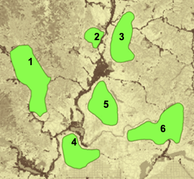

Demo data viewed in **LM_Demo.mxd.**

1) Place the *demo* directory somewhere easy to browse to *with no
spaces or special characters in the directory name* (e.g.,
*C:\LinkageMapper\demo*). Your **project directory** for the tutorial
will be **demo\output\lm**.

**2) Open LM Demo.mxd in ArcMap or in ArcGIS Pro the LM Demo map in
ArcGIS Pro Demo.aprx.**

**3) Open the Linkage Mapper Toolbox, and click on Build Network and Map
Linkages.** The following dialog will appear in ArcGIS Desktop:

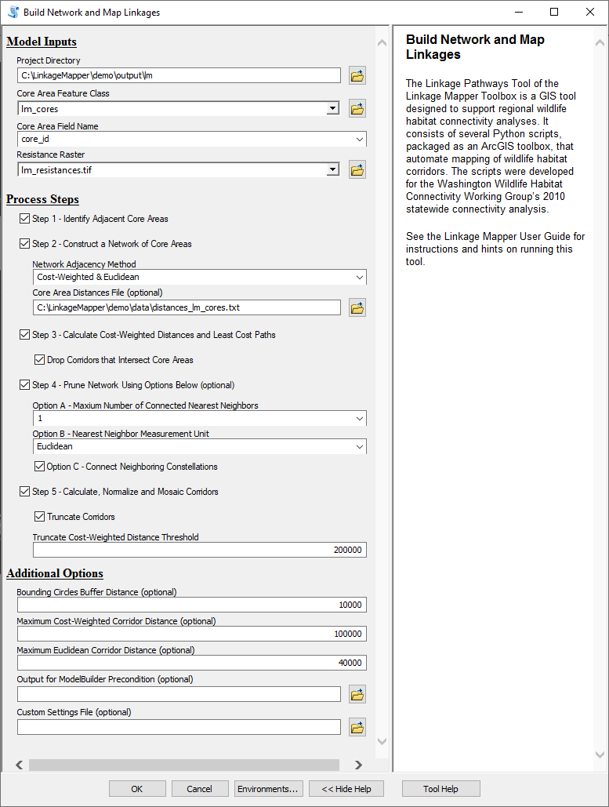

**4) Enter the following (refer to letters in dialog image above):**

A. *Input Data*

..

   *Project Directory:* Browse to where you placed the **demo**
   directory and select the **output/lm** directory within it.

   *Core Area Feature Class:* choose **lm_cores**

   *Core Area Field Name:* choose **core_id**

   *Resistance Raster:* choose **lm_resistances**

B. **Check all the steps\ .**

C. *Step 2 - Construct a Network of Core Areas*

..

   *Core Area Distances Text File:* Browse to where you placed the
   **demo** directory and open the **data** directory within it. Choose
   **distances_cores.txt (**\ If you are using ArcGIS Desktop Advanced
   or ArcGIS Pro you can leave this field blank, it will generate a
   distance file and place it in your project directory).

   *Network Adjacency Method:* Choose **Cost-Weighted & Euclidean.**

D. *Step 3 - Calculate Cost-Weighted Distances and Least-Cost Paths*

..

   *Drop Corridors that Intersect Core Areas:* **Check this box.**

E. *Step 4 - Prune Network*

..

   *Number of Connected Nearest Neighbors:* Choose **1**\ *.*

   *Nearest Neighbor Measurement Unit:* Choose **Euclidean distance.**

   *Connect Neighboring Constellations:* **Check this box.**

F. *Step 5 - Calculate least-cost corridors and mosaic them into a
   single map*

..

   *Truncate Corridors:* **Check this box.**

   *Truncate Cost-Weighted Distance Threshold:* Enter **200000**.

G. *Additional Options:*

..

   *Bounding Circles buffer Distance (optional):* Enter **10000** (equal
   to 10km).

   *Maximum Cost-Weighted Corridor Distance:* Enter **100000** (equal to
   100 km).

   *Maximum Euclidean Corridor Distance:* Enter **40000** (equal to
   40km).

**Click OK.** You can view outputs in **LM Demo Results.mxd** in ArcMap
or the **LM Results** map in ArcGIS Pro project

   |image18|\ *Warning: Some installations of ArcMap have a difficult
   time overwriting all the Linkage Pathways outputs when running the
   model again in the same project directory. In such cases, use
   ArcCatalog, or make a new subdirectory for each run.*

|image19| |image20|

Above left is the network showing active links after step 3 using the
settings above (intermediate shapefile outputs are stored in the
*run_history* directory). Yellow corridors have the lowest cost-weighted
distances, and black corridors have the longest. Note that the corridor
between cores *1* and *2* has been dropped because it is too long (118
km in cost-weighted distance units). The reason links have been dropped
can be determined by querying the stick or lcp shapefiles. Above right
is the network after running step 4. Each core area is connected to its
nearest neighbor, and the link between cores *3* and *5* connects two
otherwise disjunct constellations of core areas.

|image21| |image22|

Left: normalized and mosaicked least-cost corridors (lm_corridors in
corridors.gdb) produced by the settings above. Only values from 0 to
100,000 are shown. Right: corridors clipped to 5km cost-weighted ‘width’
cutoff using the **Clip Corridors to Cutoff Width** tool in the Linkage
Mapper Utilities toolset. See Chapter 2 of WHCWG (2010) for description
of linkage width cutoffs.

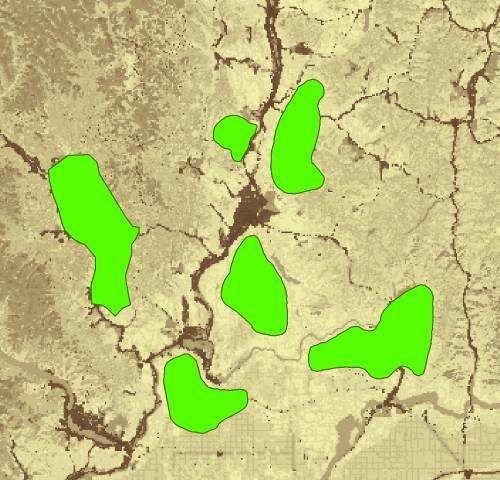
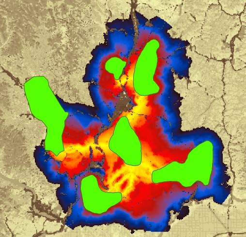
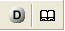

.. |image8| image:: lm/image9.jpeg
   :width: 0.47014in
   :height: 0.47153in

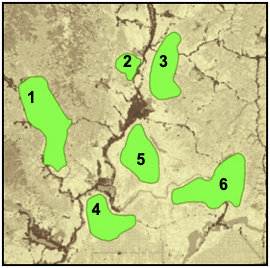
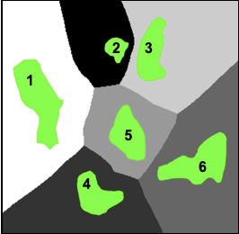
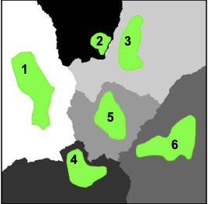

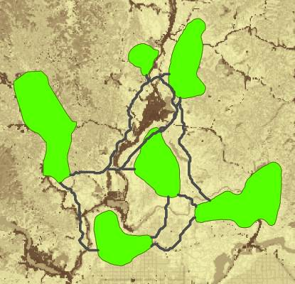
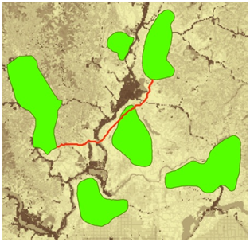

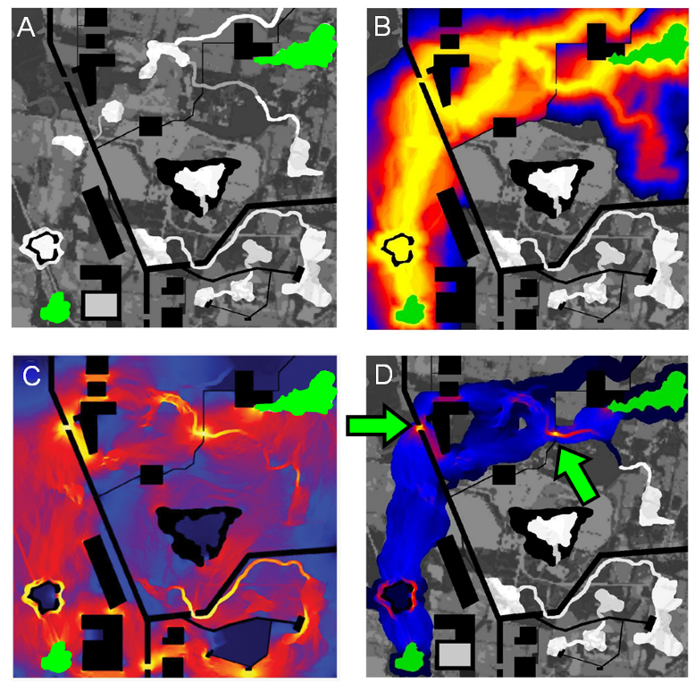

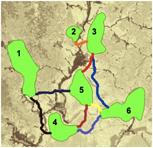
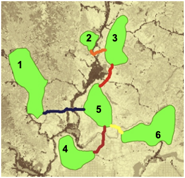
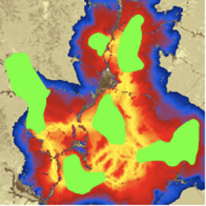
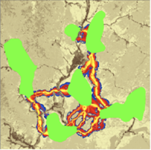
