.. _lp:

***********************
Linkage Priority
***********************

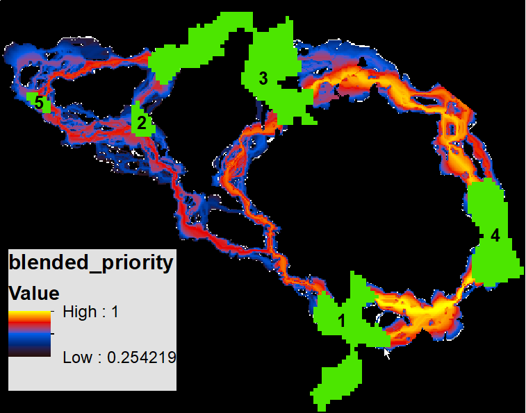

**Linkage Priority User Guide and Tutorial**

*Version 3.0—Updated July 2021*

**Software Requirements and Licensing**

Linkage Priority requires **ArcGIS Desktop** (10.3 or greater) or
**ArcGIS Pro,** with the **ArcGIS Spatial Analyst** extension. This
software is provided free of charge and is licensed under a GNU General
Public License.

**Preferred Citation**\  [1]_

Gallo, J. A., & R. Greene. 2018. Connectivity Analysis Software for
Estimating Linkage Priority. Conservation Biology Institute, OR
https://doi.org/10.6084/m9.figshare.5673715

**Table of Contents**

`1 Introduction <#introduction>`__

`1.1 Tool Overview <#tool-overview>`__

`1.2 Climate-wise Considerations (optional to run) <#climate-wise-considerations-optional-to-run>`__

`1.3 Example Applications <#example-applications>`__

`2 Acknowledgements <#acknowledgements>`__

`3 Installation <#installation>`__

`4 Using Linkage Priority <#using-linkage-priority>`__

`4.1 Required Inputs <#required-inputs>`__

`4.2 Core Area Value (CAV) Options <#core-area-value-cav-options>`__

`4.3 Corridor Specific Priority (CSP) Options <#corridor-specific-priority-csp-options>`__

`4.4 Blended Priority Options <#blended-priority-options>`__

`4.5 Additional Options <#additional-options>`__

`4.6 Advanced Settings in lp_settings.py <#advanced-settings-in-lp_settings.py>`__

`5 Other Usage Notes <#other-usage-notes>`__

`5.1 Upgrading <#upgrading>`__

`5.2 Enhancing Analyses Using Optional Settings <#enhancing-analyses-using-optional-settings>`__

`5.3 Other Suggestions and Troubleshooting <#other-suggestions-and-troubleshooting>`__

`5.4 Other Applications <#other-applications>`__

`6 Community <#community>`__

`7 Key Acronyms <#key-acronyms>`__

`8 Select References <#select-references>`__

`9 Linkage Priority Tutorial <#linkage-priority-tutorial>`__

`9.1 Run Linkage Pathways, then Linkage Priority Tool with Defaults <#run-linkage-pathways-then-linkage-priority-tool-with-defaults>`__

`9.2 Add Other Core Area Value (e.g. Climate Refugia) <#add-other-core-area-value-e.g.-climate-refugia>`__

`9.3 Using Climate Signature to Prioritize Climate Analogs <#using-climate-signature-to-prioritize-climate-analogs>`__

`9.4 Combine the above sections into a single model run. <#combine-the-above-sections-into-a-single-model-run.>`__

`10 Advanced Linkage Priority Tutorial <#advanced-linkage-priority-tutorial>`__

`10.1 Shortcut for Multiple Runs <#shortcut-for-multiple-runs>`__

`10.2 Add Centrality <#add-centrality>`__

`10.3 Inspect Core Area Value Component Calculations <#inspect-core-area-value-component-calculations>`__

`10.4 Export Corridor Importance Value <#export-corridor-importance-value>`__

Introduction
============

Linkage Priority (LP) is an ArcGIS tool that helps quantify the relative
conservation priority of each linkage in a landscape.

LP is run after linkages are created using the Linkage Pathways (LM)
tool of the Linkage Mapper Toolbox (McRae and Kavanagh 2011). (The
implementation of this original Linkage Mapper tool is hereafter
symbolized as “LM” in this version of the User Guide).

Tool Overview
-------------

The Linkage Priority Tool is based on weighted combinations among many
factors (see below Figure). The lower set of factors on the diagram
estimate the relative priority of the two cores at either end of a
linkage. These factors include the shape, mean resistance value, size,
and expert opinion. An assumption is then made that a linkage which
connects two really important core areas is a higher conservation
priority than one that connects two marginal core areas. The tool
calculates this relative value for every linkage. This output is
combined with the other higher-level factors (top row) that relate
directly to linkage priority, including the permeability of each linkage
(i.e., the mean resistance values along the least cost path), the
proximity, the centrality (i.e. how central the linkage is to the entire
network), and an expert opinion option. The expert opinion option is
implemented via a table of each linkage as a row, and a relative value
of each linkage based on expert opinion, or other factors, such as
demographic analyses.

**Figure: Diagram of all the optional criteria that can be used in
determining the relative priority of each linkage**

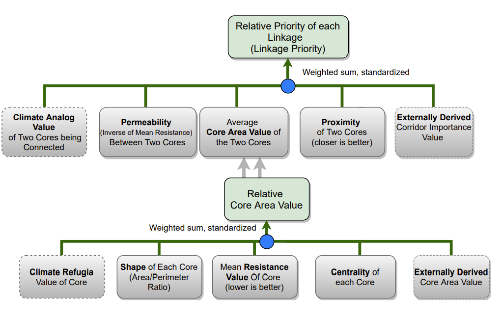

Climate-wise Considerations (optional to run)
---------------------------------------------

There are many climate considerations that can be incorporated in
habitat connectivity modeling and mapping. Two have previously been
pursued in isolation from each other, and yield quite different
recommendations for linkage priority. However, we maintain that they are
two extremes of the same continuum, and have updated this tool (in v3.0
compared to v2.0) so the user can model for one, or the other, or an
appropriate blend between both (which we recommend). The first
consideration is “range shift connectivity”, and gives higher priority
for linkages that connect core areas that will become too hot/dry in the
future with cores that are much cooler/wetter, allowing species to “move
to higher ground” (Keeley et al. 2018). Meanwhile, “climate analog
connectivity” gives higher priority to linkages with the destination
core having the same predicted climate at a future time (e.g. 2050), as
the climate in the source core at the current time (e.g. Littlefield et
al. 2017). Each approach is better than nothing, but each has its
opposing questionable assumptions. In addition to being able to model
for a balance between these assumptions, we also added “preferred
climate” as a factor in defining linkage priority. If this parameter is
used, then linkages that end in a core area that is predicted to be near
the preferred climate are given higher priority than linkages that lead
to core areas predicted to be much hotter/drier than the preferred
climate. More details are provided in the “white paper / specifications
document”, the conference presentation video, and conference slides
(Gallo, 2019a,b,c). This criterion, on the top row of the diagram, is
optional. Users can also include climate in determine relative core area
value, by giving higher value to cores with higher amount of climate
refugia. This criterion, on the bottom row of the diagram, is also
optional.

See the section 9.3 “Using Linkage Priority/Add Climate Signature” for
more details.

Example Applications
--------------------

Prototype applications of various beta versions of the Linkage Priority
Tool have been performed in seven regions (Sierra Nevada mountains,
Sonoma County, Santa Barbara County, West Mojave, Sacramento Valley, and
Modoc Plateau), with outputs available on a `databasin.org
Gallery <https://databasin.org/galleries/027492e42545494cae53ca1f61b46c17>`__
and reports (Spencer et al. 2019; Gallo et al. 2019a, Gallo et al.
2019b). Climate was considered in several of these in determining
priority in several ways: (1) quantifying which linkages best
facilitated long-term species range shifts, (2) which core areas had
more stable climate over time and hence provided refuge from climate
change, and (3) which core areas contained more climate micro-refugia
for withstanding climate change.

Acknowledgements
================

The first iteration of the Linkage Priority Tool was developed thanks to
funding from a South Africa National Research Foundation post-doctoral
research grant (#47264) through Nelson Mandela Metropolitan University.
We would like to thank the additional organizations that have funded
this work in various co-production applications: Sonoma County
Agricultural Preservation and Open Space District, The Wilderness
Society, California Department of Fish in Game via Dr. Megan Jennings,
Charlotte Martin Foundation, and Conservation Biology Institute.

Thanks also to Darren Kavanagh, Annie Prisbrey, Nik Stevenson-Molner,
Tim Sheehan, Nathaniel Mills, and Justin Brice for their advice and
their participation in the updates and/or releases of LP.

In caring memory of Brad McRae, the founding developer of Linkage Mapper
toolbox. “Everyone who knew Brad was impressed with his intelligence,
thoughtfulness, integrity, honesty, and his steadfast commitment to what
he cared about: his family, friends and conserving the natural
world.” [2]_

Installation
============

Download Linkage Mapper v3.0 or greater from
https://circuitscape.org/linkagemapper and first follow the installation
instructions of the Linkage Pathways User Guide. You can test your
installation by running the tutorial at the end of this document.

Using Linkage Priority
======================

The key factors of LP’s multi-criteria analysis are summarized above in
the introduction.

The weights for these, and the associated parameters, are accessed
through the ArcGIS toolbox tool. LP is run after understanding and
running LM, and optionally after Centrality Mapper. Open LP from the
Linkage Mapper toolbox.

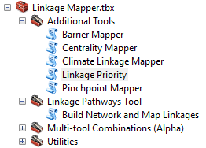

Descriptions for the required and optional tool parameters follow. They
are also available in the tool dialog by selecting a parameter and
clicking Show Help >>, for example:

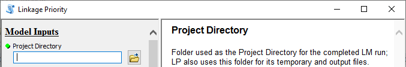

For additional details, please see section 5 Other Usage Notes later in
this document.

Required Inputs
---------------

-  *Project Directory*: Folder used as the Project Directory for the
   completed LM run; LP also uses this folder for its temporary and
   output files.

-  *Core Area Feature Class*: Core habitat area polygons, used as the
   Core Area Feature Class for the completed LM run.

-  *Core Area Field Name*: Field in the Core Area Feature Class
   containing a unique identifier for each core, used as the Core Area
   Field Name for the completed LM run.

-  *Resistance Raster*: Cost raster, used as the Resistance Raster for
   the completed LM run.

   1. .. rubric:: Core Area Value (CAV) Options
         :name: core-area-value-cav-options

-  *Other Core Area Value (OCAV) Raster*: optional raster whose values
   within each core will be averaged to create the OCAV for that core

-  Weighted sum weights (should sum to 1) to be used in the calculation
   of the CAV attribute:

   -  *Resistance Weight*: Decimal value between 0 and 1 to be
      multiplied by the normalized mean resistance for the core.
      (Default value: 0.33)

   -  *Size Weight*: Decimal value between 0 and 1 to be multiplied by
      the normalized size of the core.(Default value: 0.33)

   -  *Area/Perimeter Weight*: Decimal value between 0 and 1 to be
      multiplied by the normalized area/perimeter ratio of the core.
      (Default value: 0.34)

   -  *Expert Core Area Value (ECAV) Weight*: Decimal value between 0
      and 1 to be applied to the normalized optional ecav field, for
      storing an expert assessment of the relative value of each core;
      see sections 5.2 and 5.4 below for additional details. (Default
      value: 0)

   -  *Current Flow Centrality (CFC) Weight*: Decimal value between 0
      and 1 to be applied to the normalized CF_Central field, which is
      optionally calculated by Centrality Mapper after running LM but
      before running LP; see section 5.2 below for additional details.
      (Default value: 0)

   -  *Other Core Area Value (OCAV) Weight*: Decimal value between 0 and
      1 to be applied to the normalized ocav field, which is calculated
      from the optional OCAV raster; see section 6.2 below for
      additional details. (Default value: 0)

   1. .. rubric:: Corridor Specific Priority (CSP) Options
         :name: corridor-specific-priority-csp-options

-  *Core Pairs Table Containing Expert Corridor Importance Value
   (optional)*: a table, feature class or raster attribute table of the
   user’s choice containing an Expert Corridor Importance Value (ECIV)
   field that stores an expert assessment of the relative value of each
   corridor.

   -  *From Core Field*: Field in the Core Pairs Table that stores the
      unique identifier for one of the cores in the pair.

      -  *Note*: User may need to manually type in the Field Names
         rather than finding them as drop-down options.

   -  *To Core Field*: Field in the Core Pairs Table that stores the
      unique identifier for the other core in the pair.

   -  *Expert Corridor Importance Value Field*: Field in the Core Pairs
      table that stores the expert assessment of the corridors.

-  *Current Climate Signature Raster (optional)*: Optional raster used
   to calculate the current climate signature (i.e. envelope) for each
   core, which feeds into the climate signature difference calculation
   for the two cores at the end of each corridor; see Gallo, 2019 and
   section 5.2 below for additional details.

   -  *Modify the Advanced Climate Signature Parameters? (optional)* If
      this is checked, then the below parameters will turn from grey to
      black. If left unchecked, then the analysis will move forward with
      the assumption that the relative difference in climate between
      cores is much higher than the relative difference in climate at a
      core between time steps. Hence, the Current Climate Signature
      Raster will be used as a surrogate for the Future Climate
      Signature Raster, and all the below default parameter values will
      be used.

   -  *Future Climate Signature Raster*: An optional raster used to
      calculate the future climate signature (i.e. envelope) for each
      core, which feeds into the climate signature difference
      calculation for the two cores at the end of each corridor; see
      section 5.2 below for additional details

   -  *Linkage Priority of Minimum Climate Analog Ratio*: This is
      A\ :sub:`Rmin` , the lower left starting point of the curve in
      Figure 1 of the white paper. It is the value assigned as the
      Climate Analog Linkage Priority Value (A) for the core pair on the
      landscape that has the lowest Climate Analog Ratio I; which is
      |<math
      xmlns="http://www.w3.org/1998/Math/MathML"><msub><mi>C</mi><mrow><mi>D</mi><mi>T</mi></mrow></msub></math>|
      / |<math
      xmlns="http://www.w3.org/1998/Math/MathML"><msub><mi>C</mi><mrow><mi
      mathvariant="normal">S</mi><mn>0</mn></mrow></msub></math>| ,
      (i.e. the climate value of the destination core (D) at the future
      time step, T, divided by the climate value of the starting
      (hotter) core at the present time, T = 0). (Default value: 0.75)

   -  *Linkage Priority of Maximum Climate Analog Ratio*: This is
      A\ :sub:`Rmax` , the y-axis value of the lower right value of the
      curve in Figure 1 of the white paper. It is the Climate Analog
      Linkage Priority Value (A) of the core pair on the landscape that
      has the highest Climate Analog Ratio (R) , which is |image1| /
      |<math
      xmlns="http://www.w3.org/1998/Math/MathML"><msub><mi>C</mi><mrow><mi
      mathvariant="normal">S</mi><mn>0</mn></mrow></msub></math>| ,
      (i.e. the climate value of the destination core (D) at the future
      time step, T, divided by the climate value of the starting
      (hotter) core at the present time, T = 0). (Default value: 0)

   -  *Lowest Allowable Maximum Climate Analog Ratio on the “Value
      Curve”*:

      -  This parameter is for adding realism to the model for rare
         situations. With the default value used, then the parameter
         only affects the model in these rare situations, so the user
         can skip learning about this parameter when learning the model
         for the first time.

      -  The problem is more likely to occur when there are only a few
         cores, or when only looking a short time into the future. The
         problem occurs when two conditions occur: (1) the Maximum
         Climate Analog Ratio (R) for two cores on a landscape (Rmax)
         was just a bit over 1 [R is CDT/ CS0, (i.e. is the climate
         value of the destination core (D) at the future time step, T,
         divided by the climate value of the starting (hotter) core at
         the present time.)], AND (2) if the default value of 0 is used
         for *Linkage Priority of Maximum Climate Analog Ratio*
         (LPMCAR). If the *Linkage Priority of Maximum Climate Analog
         Ratio*\ value is 1 (the default), then this makes an extremely
         steep curve on the right side of the Value Curve. And in this
         case, a destination core that is just a bit hotter in the
         future compared to the current climate of the starting core,
         will be penalized extremely, which is much more than common
         sense dictates.

      -  For once off analyses, this problem can be addressed simply by
         adjusting the value of LPMCAR higher, to something like 0.5 or
         0.75. But, for iterative allocation algorithms like LandAdvisor
         (Gallo et al. 2020), using the default value of 0 is most
         useful in discriminating linkages during all iterations.

      -  To deploy this *Lowest Allowable Maximum Climate Analog Ratio*
         parameter, the user defines the x-axis value that is the
         minimum allowable value associated with the right hand most
         part of the graph. If this user defined value is greater than
         the Rmax of the particular landscape, then this user defined
         value is the one that the model uses as the maximum Climate
         Analog Ratio of the Value Curve. The default value of 1.15 is a
         good balance of opposing factors for fixing the problem. For
         many landscapes Rmax is much greater than 1.15, so with this
         default value of 1.15 used, this entire parameter would then be
         ignored by the model. (Default value: 1.15)

   -  *Relative Priority of Achieving the Targeted Ratio*: The value of
      A (on the Y-axis of the chart in the white paper) that corresponds
      with R\ :sub:`targeted` on the graph. This value of A is referred
      to as A\ :sub:`Rtargeted` . (Default value: 1)

   -  *Target Climate Analog Ratio*: The targeted value of R,
      R\ :sub:`targeted`, that is the value on the X axis of the chart
      in the white paper that is the inflection point on the curve
      between R\ :sub:`min` and R\ :sub:`max` . For all but the most
      extreme edge cases, this is going to be the R that is the highest
      linkage priority value. (Default value: 1)

   -  *Climate Analog Linkage Priority Weight*: This is the relative
      weight of the Climate Analog Linkage Priority (A) of a linkage
      compared to the Climate Preference Linkage Priority Weight. These
      two weights should add to 1. The default value is 0.67 for now
      since this is a more established concept than Climate Preference
      and is also arguably more important. (Default value: 0.67)

   -  *Preferred Climate Signature Value for a Core*: At future time T,
      what is the preferred climate value of a core area? An initial
      approach to determining this value would be to look at a map of
      climate signature at the current time, and to look at the climate
      signature values of the places that currently have a preferred
      climate for the species and/or ecological processes that are being
      targeted. In other words, just because a linkage has a great
      climate analog match, does not mean it is a perfect climate-wise
      linkage. If it is matching a relatively hot/dry core to a core
      that is also relatively hot/dry in the future, it is not as good
      as if it were matching a cool/wet core to a core that is cool/wet
      in the future. (Default value: 1)

   -  *Relative Priority of Minimum Climate Preference Attainment
      Ratio*: This is L\ :sub:`Gmin` , which is subjective. It is the
      Relative Priority of the Linkage’s Climate Preference Attainment
      Ratio (L) of the core pair on the landscape that has the lowest
      Climate Preference Attainment Ratio (G). (Default value: 0.5)

   -  *Relative Priority of Maximum Climate Preference Attainment
      Ratio*: This is L\ :sub:`Gmax` , which is subjective. It is the
      Relative Priority of the Linkage’s Climate Preference Attainment
      Ratio (L) of the core pair on the landscape that has the highest
      Climate Preference Attainment Ratio (G). (Default value: 0)

   -  *Climate Preference Linkage Priority Weight:* This is the relative
      weight of the Climate Preference Linkage Priority (L) of a linkage
      compared to the Climate Analog Linkage Priority Weight (A). These
      two weights should add to 1. The default value is 0.33 for now
      since this is a less established concept than Climate Analog
      value, and would also likely be deemed less important in most
      expert workshops. (Default value: 0.33)

-  CSP weighted sum weights (should sum to 1) used to create a CSP
   raster for each corridor:

   -  *Closeness Weight*: Decimal value between 0 and 1 to be multiplied
      by the normalized distance between the two cores of the corridor.
      (Default value: 0.33)

   -  *Permeability Weight*: Decimal value between 0 and 1 to be
      multiplied by the normalized permeability (inverse of the average
      resistance) of the corridor. (Default value: 0.33)

   -  *Core Area Value Weight*: Decimal value between 0 and 1 to be
      multiplied by the normalized average CAV of the two cores of the
      corridor. (Default value: 0.34)

   -  *Expert Corridor Importance Value Weight*: Decimal value between 0
      and 1 to be multiplied by the normalized ECIV of the corridor.
      (Default value: 0)

   -  *Climate Gradient Weight in CSP Calculation*: Decimal value
      between 0 and 1 to be multiplied by the weighted sum between
      climate preference priority value and climate analog linkage
      priority. (Default value: 0)

-  *Minimum Linkage Priority Value Mapped (optional)*:

   -  This optional parameter is the minimum allowable value for Linkage
      Priority that will be mapped. Any linkages with a value lower than
      this will not be mapped. This filters out poor quality linkages
      and insures that the blended map will only contain high quality
      linkages. The linkage table of the linkages that are not mapped
      should have a code for this type of removal.

   1. .. rubric:: Blended Priority Options
         :name: blended-priority-options

-  Blended Priority weighted sum weights (should sum to 1) used to
   create the blended_priority output raster:

   -  *Truncated Corridors Weight*: Weight to be multiplied by the
      truncated least cost corridors output (e.g.
      project_corridors_truncated_at_200k ). (Default value: 0.5)

   -  *Linkage Priority Weight*: Weight to be multiplied by the each
      linkage’s linkage_priority raster in memory. (Default value: 0.5)

   1. .. rubric:: Additional Options
         :name: additional-options

-  *Output for ModelBuilder Precondition*: Optional output copy of the
   input cores, which can be used in ModelBuilder workflows to indicate
   that LP has finished processing.

-  *Custom Settings File*: Optional .py file to be used in place of
   lp_settings.py, which facilitates keeping all the settings needed to
   reproduce a scenario run. (See below section).

   1. .. rubric:: Advanced Settings in lp_settings.py
         :name: advanced-settings-in-lp_settings.py

The following settings will not normally need to be changed, and can
only be changed by editing lp_settings.py (in toolbox/scripts).

-  CALCCSPBP (number): Calculate Corridor Specific Value (i.e. Linkage
   Priority) (CSP) or CSP & Blended Priority (BP) No_Calc=0, CSP=1,
   CSP_BP=2

-  RELPERMNORMETH (number): relative permeability normalization method
   (use 0 for score range normalization; any other value for maximum
   value normalization)

-  RELCLOSENORMETH (number): relative closeness value normalization
   method (use 0 for score range normalization; any other value for
   maximum value normalization)

-  RESNORMETH (number): resistance normalization method (use 0 for score
   range normalization; any other value for maximum value normalization)

-  SIZENORMETH (number): size normalization method (use 0 for score
   range normalization; any other value for maximum value normalization)

-  APNORMETH (number): area/perimeter ratio normalization method (use 0
   for score range normalization; any other value for maximum value
   normalization)

-  ECAVNORMETH (number): ecav normalization method (use 0 for score
   range normalization; any other value for maximum value normalization)

-  CFCNORMETH (number): cfc normalization method (use 0 for score range
   normalization; any other value for maximum value normalization)

-  CANALOGNORMETH (number): climate analog normalization method (use 0
   for score range normalization; any other value for maximum value
   normalization)

-  CPREFERNORMETH (number): climate analog normalization method (use 0
   for score range normalization; any other value for maximum value
   normalization)

-  NORMCORRNORMETH (number): normalized corridor normalization method
   (use 0 for score range normalization; any other value for maximum
   value normalization)

-  MAXCSPWEIGHT (Boolean): relative max CSP value weight in CPV
   calculation

-  MEANCSPWEIGHT (Boolean): relative mean CSP value weight in CPV
   calculation

-  HIGHERCE_COOLER (Boolean): higher climate envelop values are cooler
   (Boolean)

-  KEEPINTERMEDIATE (Boolean): keep intermediate outputs for
   troubleshooting purposes

5. .. rubric:: Other Usage Notes
      :name: other-usage-notes

   1. .. rubric:: Upgrading
         :name: upgrading

For those upgrading to version 3.0 from earlier versions of LM, please
consider the following:

-  If you want your old projects to automatically use the new LM and LP,
   install the toolbox in the same location as the previous version.

-  Due to the addition of new LM parameters in the LM tool dialog,
   running LM from geoprocessing results history will result in “ERROR
   000820 The parameters need repair”. To overcome this issue, run LM
   from the toolbox, not from the geoprocessing history.

-  ModelBuilder models that use LM will need to be edited, re-validated
   and saved.

   1. .. rubric:: Enhancing Analyses Using Optional Settings
         :name: enhancing-analyses-using-optional-settings

LP’s optional settings can be used in a variety of ways. Some
suggestions are provided here:

-  Climate change analyses can be incorporated into linkage
   prioritization in at least two ways:

   -  By providing an Other Core Area Value raster, such as a refugia
      dataset, that reflects the relative importance of different areas
      of the landscape in providing resilience to climate change.

      -  This will impact the Core Area Value, which is a component of
         Corridor Priority Value.

      -  See the Linkage Priority Tutorial below for an example.

   -  By providing Current, and optionally Future, Climate Signature
      datasets, which allow a Climate Signature Difference to be
      calculated for each corridor.

      -  See the Linkage Priority Tutorial below for an example.

-  Expert input can be incorporated in at least two ways:

   -  By adding an Expert Core Area Value field (must be name “ecav”) to
      the Cores polygon input dataset. This will impact the Core Area
      Value, which is a component of Corridor Priority Value.

   -  By providing a table of core pairs, with an Expert Corridor
      Importance Value (ECIV) field (can be any name). ECIV is an
      optional component of Corridor Priority Value.

-  Centrality is a measure of how important a link or core area is for
   keeping the overall network connected. If run, Centrality Mapper will
   create a field in the Cores polygon dataset called CF_Central.
   Providing a Current Flow Centrality Weight will normalize CF_Central
   and include it in the Core Area Value calculation.

   1. .. rubric:: Other Suggestions and Troubleshooting
         :name: other-suggestions-and-troubleshooting

-  When creating a field to store expert values for ECIV for each
   corridor, project_LCPs is not a good place to do this because it gets
   overwritten on every run of the LM tools. One option is to make a
   copy of this feature class in another location and use it.

-  If you encounter an error along the lines of “ERROR 010423:
   project_RCI.RASTER.1(Band_1) does not have valid statistics as
   required by the operation” when calculating overall linkage priority,
   it could be that the setting used for Proportion of Top CSP Values to
   Keep resulted in an empty Corridor Specific Priority for one or more
   corridors, and therefore an empty RCI raster. Try a larger value for
   the Proportion of Top CSP Values to Keep setting.

-  If you move the project directory structure and files to another
   location after LM has been run (not advised), please note that:

   -  LM must be re-run before LP can be run, because the LM environment
      has been picked up from the run history and contains the old path.

   -  You cannot re-run the LM family of tools from the geoprocessing
      history because the location of the tools will have changed.

   -  Also, you cannot rename a LM Project folder, even keeping it in
      place, and expect LP to run on that folder.

   1. .. rubric:: Other Applications
         :name: other-applications

LP came about primarily to facilitate embedding of linkage analysis in
iterative geoprocessing routines such as Land Advisor models (Aplet et
al. 2016, Gallo et al. In Prep). Land Advisor evaluates a landscape for
conservation priorities, uses a greedy heuristic to assume the highest
priority area is conserved, and then repeats the process to identify the
second-highest priority area. Embedding LM/LP allows Land Advisor to
extend its scope from prioritization of core protected areas to include
prioritization of corridors among them.

Of course, LP can also be used in standalone corridor identification
projects that require prioritization of conservation action among
potential corridor areas. Doing such an analysis draws from a rich field
of theory and practice. Perhaps the best repository of such information
is https://conservationcorridor.org/library/ and the best practical
guide for getting up to speed on the practice of resistance-surface
based connectivity modeling is by Wade et al. (2015).

Community
=========

Please join the Linkage Mapper User Group to get updates, report bugs,
and suggest enhancements
(https://groups.google.com/forum/#!forum/linkage-mapper).

We also encourage contributions to the LM project by ArcGIS/Python
developers. This could include enhancements and fixes to existing tools,
and development of new tools for the LM toolbox. We encourage new tools
to follow the protocols in Linkage Priority and Climate Linkage Mapper,
which are currently the two newest tools in the LM toolbox. The source
code repository is at https://github.com/linkagescape . We welcome any
comments and suggested edits to the latest version of this and other
user guides available in the repository as Word documents.

Key Acronyms
============

-  CAV = Core Area Value

-  CFC = Current Flow Centrality

-  CPV = Corridor Priority Value

-  CSP = Corridor Specific Priority

-  CW = Cost Weighted

-  CWD = Cost Weighted Distance

-  ECAV = Expert Core Area Value

-  ECIV = Expert Corridor Importance Value

-  LCP = Least Cost Path

-  LP = Linkage Priority

-  LM = Linkage Mapper

-  OCAV = Other Core Area Value

-  RCI = Relative Corridor Importance

Select References
=================

Aplet, G, P. McKinley, and J. Gallo. 2016. Keynote Presentation:
Spreading Conservation Risk with a Portfolio of Strategies. Natural
Areas Association. Sacramento, CA Oct.
[`video <http://cdnapi.kaltura.com/index.php/extwidget/preview/partner_id/1770401/uiconf_id/28589212/entry_id/0_je7bsg2d/embed/dynamic>`__]

Gallo, J., E. Butts, T. Miewald, and K. Foster. 2019a. Comparing and
Combining Omniscape and Linkage Mapper Connectivity Analyses in Western
Washington. Conservation Biology Institute.
https://doi.org/10.6084/m9.figshare.8120924

Gallo, J., G. Aplet, R. Greene, J. Thomson, and A. Lombard. 2020. A
Transparent and Intuitive Modeling Framework and Software for Efficient
Land Allocation. *Land*. https://doi.org/10.3390/land9110444

Gallo, JA. 2019a. ​Software for prioritizing habitat linkages based on
climate gradients, climate analogs, or a balanced blend.
​\ https://doi.org/10.6084/m9.figshare.7689080

Gallo, JA. 2019b. Video: ​Software for prioritizing habitat linkages
based on climate gradients, climate analogs, or a balanced blend.
International Conference for Conservation Biology, Kuala Lampur,
Malaysia, July 25. ​\ https://doi.org/10.6084/m9.figshare.9161864

Gallo, JA. 2019c. Slides: ​Software for prioritizing habitat linkages
based on climate gradients, climate analogs, or a balanced blend.
International Conference for Conservation Biology, Kuala Lampur,
Malaysia, July 25. ​\ https://doi.org/10.6084/m9.figshare.9072662

Gallo, J. A., J. Strittholt, G. Joseph, H. Rustigian-Romsos, R. Degagne,
J. Brice, and A. Prisbrey. 2019b. “Mapping Habitat Connectivity Priority
Areas That Are Climate-Wise and Multi-Scale, for Three Regions of
California.” Conservation Biology Institute.
https://doi.org/10.6084/m9.figshare.7477532

McRae BH, Kavanagh DM. 2011. Linkage Mapper Connectivity Analysis
Software. The Nature Conservancy, Seattle, WA. Available from
http://www.circuitscape.org/linkagemapper

Spencer, Wayne, Justin Brice, Deanne DiPietro, John Gallo, Michelle
Reilly, and Heather Rusigian-Romsos. 2019. “Habitat Connectivity for
Fishers and Martens in the Klamath Basin Region of California and
Oregon.” Conservation Biology Institute.
https://doi.org/10.6084/m9.figshare.8411909

Wade, Alisa A., McKelvey, Kevin S., and Schwartz, Michael K. 2015.
Resistance-surface-based wildlife conservation connectivity modeling:
Summary of efforts in the United States and guide for practitioners.
General Technical Report RMRS-GTR-333. U.S. Department of Agriculture,
Forest Service, Rocky Mountain Research Station, Fort Collins, CO.
Available from
http://www.fs.fed.us/rm/pubs/rmrs_gtr333.pdf

9. .. rubric:: Linkage Priority Tutorial
      :name: linkage-priority-tutorial

   1. .. rubric:: Run Linkage Pathways, then Linkage Priority Tool with
         Defaults
         :name: run-linkage-pathways-then-linkage-priority-tool-with-defaults

-  Open *LP Demo.mxd* in ArcMap or the *LP Demo* map in
   *ArcGIS Pro Demo.aprx*.

-  Use the catalog window to make a folder within the demo/output folder
      called lpv001

   -  Optional: examine the resistance surface and core areas and see if
         you can predict where the linkages will be modeled, and where
         they will be wide and narrow.

-  Open Linkage Mapper and run the **Build Network and Map Linkages**
   tool in “Linkage Pathways Tool” toolset.

   -  Set lpv001 as the Project Directory, use lp_cores, core_id, and
      lp_resistances as per the Linkage Pathways Tutorial, and the
      default settings. Includeshaving “Truncate Corridors” (under Step
      5) clicked on. (This will clip the width of the linkage to be
      200,000 cost weighted distance units from the least cost path.)

-  The screengrab below from ArcGIS Desktop is how your settings should
   look before you press run, if you have run the tool using ArcGIS
   Desktop Advanced or ArcGIS Pro.

   -  If you don’t have ArcGIS Desktop Advanced or ArcGIS Pro, you will
      also need to select distances_lp_cores.txt (provided in the data
      folder) as the Core Area Distances Text File. (See LM user guide
      for info on how to create such a file)

..

   .. image:: lp/image12.png
      :width: 5.22132in
      :height: 8.16875in

-  Click **OK** to run the tool.

   -  Optional: You have now made your linkages, please see if they met
      your expectations by adding them to the map:
      …demo\output\lpv001\output\corridors.gdb\lpv001_corridors_truncated_at_200k

..

   It should look like: |image2|

-  See the Linkage Pathways tutorial for more information on them.

-  Optional: click the cores and linkages on and off and think about how
   you would rank the linkages in order of importance.

-  Then, open the **Linkage Priority tool** in the Additional Tools
   toolset, point to the same inputs, and use the default settings:

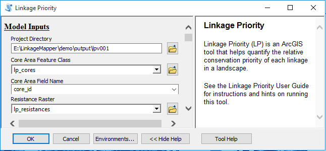

-  Click **OK** to run the tool.

-  |image3|\ After completion, add the dataset
   demo\output\lpv001\output\corridors.gdb\blended_priority to your map,
   and symbolize it with a Minimum-Maximum stretch.

..

   *Symbology tip: Custom color ramps for Linkage Mapper are available
   in ArcGIS style files saved in toolbox\styles folder. See the
   relevant ArcGIS help page on how add custom styles to your
   application.*

   The output is referred to later as the “Default Run” and with the
   custom color combo (inverted) it should look like the following after
   you turn off the resistance surface:

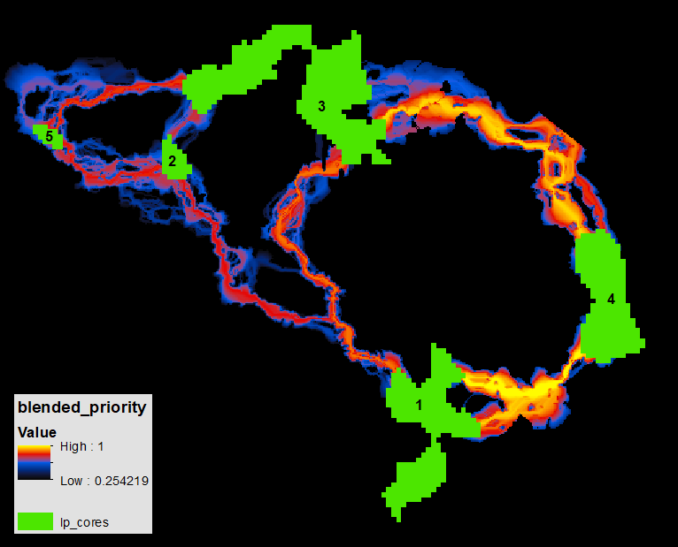

-  The output above shows that, based on default parameters, the most
   important linkage is between cores 1 and 4, closely followed by
   linkage 3-4. Default parameters: only using closeness, permeability,
   and core area value to determine linkage priority, and for core area
   value, only using average core resistance value, size, and
   area/perimeter weight; even weights.

-  To save time, continue using the lpv001 directory, and move to the
   next section.

   -  Optional: *If you do not want to overwrite your previous run
      outputs*,

      -  Make a new folder called lpv002 and run **Build Network and Map
         Linkages** tool again, and then run Linkage Priority Tool with
         the changes below to the default values.

      -  Alternatively, you can copy your lpv001/output folder and paste
         it and rename the copy something like lpv001/output1.

-  Sometimes it is useful to see the priority value of each linkage
   mapped explicitly. To get this, change the weights of the blend, so
   that only Linkage Priority gets a weight:

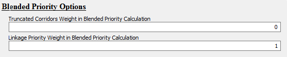

Yielding:

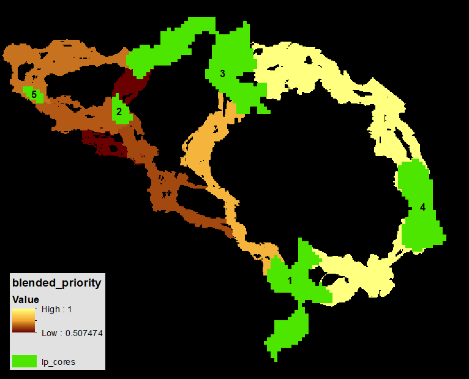

Add Other Core Area Value (e.g. Climate Refugia)
------------------------------------------------

In addition to the default considerations for Core Area Value, LP has
several **optional features**, including considering an additional
raster input. This **Other Core Area Value** is averaged for each core
area. It can be used for example, to give higher priority to corridors
where the connected cores constitute important climate refugia areas. A
dataset, lp_climate_refugia.tif, has been added to the demo maps to
demonstrate this capability, it has higher values for areas of more
stable climate and more topographic heterogeneity (from
https://databasin.org/datasets/d58de1a0b08443fea53c25b70804866c).

-  Optional: Take a moment to examine the layer, click on and off the
   core areas, and predict how it will change the results.

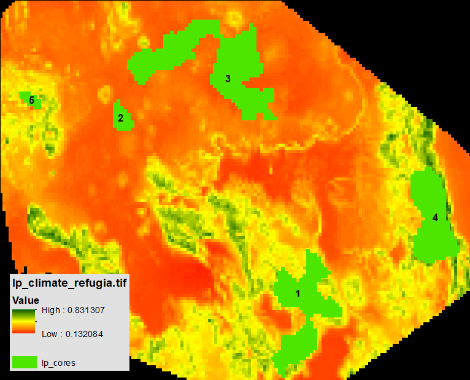

-  Add it to the model run, as per the following, and use the following
   parameters to focus solely on the impact of this criterion

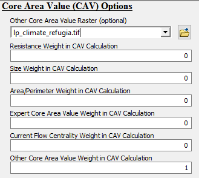

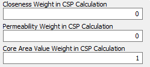

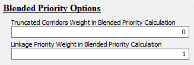

Yielding:

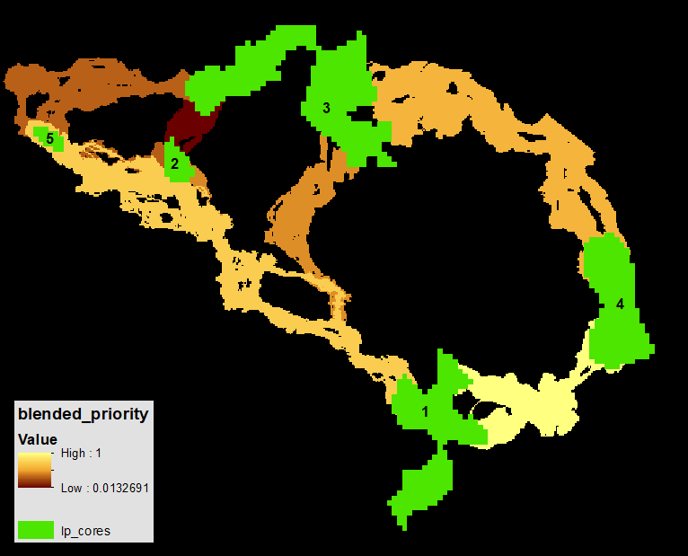

-  Note how the relative importance of linkages 2-5 and 1-4 are now
   higher. This is because cores 4,1, and 5 have more micro-refugia, and
   hence a higher average refugia score, than the other cores.

-  Pro-tip:

   -  To see the relative climate refugia value per core area, open the
      cores attribute file (after the model run) and look at the “ocav”
      field (other core area value). Higher value corresponds to more
      refugia.

   -  To see the priority values as least cost paths, load
      link_maps.gdb/lpv001_LCPs and style CSP_Norm

   1. .. rubric:: Using Climate Signature to Prioritize Climate Analogs
         :name: using-climate-signature-to-prioritize-climate-analogs

Another one of LP’s **optional features** for prioritizing corridors is
**climate signature**. We are defining climate signature as a numerical
value that represents the relative temperature and amount of
precipitation in an area over a period of time, such as a year. In
version 3.0, this treatment has been significantly improved compared to
version 2.0. See section 1.2 “Climate-wise Options” for more details,
and the draft white paper that it links to.

First, let’s examine the climate signature input layer
climate_signature_current (below screengrab). (Climate Water Deficit,
which has both temperature and precipitation in one metric:
https://databasin.org/datasets/dbd45814e4db43dea4472c3a3ccacd9b.) Higher
numbers represent hotter/drier conditions. The climate signature of a
core is calculated as the mean value of this layer.

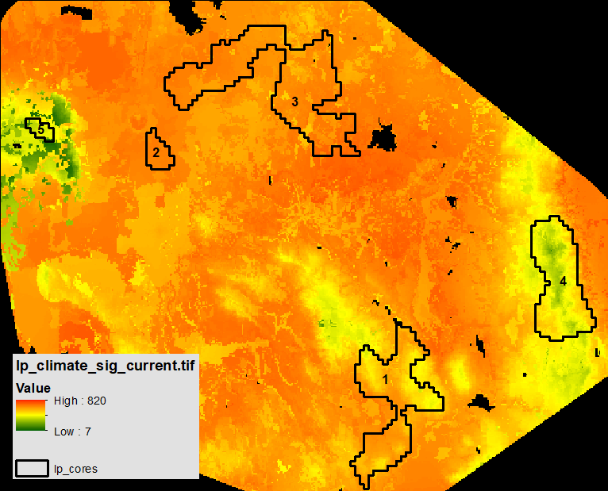

-  There is a similar sample layer for the future climate projections
   (~2070-2099):
   https://databasin.org/datasets/fd8adae0ab9149c0b200f11ab9e2d54b

-  Pro Tip: after a model run, the mean current climate signature value
   per core is the field in the cores layer called cclim_env. And for
   the future, it is fclim_env

-  By visual inspection, you can see that core area 5 is currently the
   coolest/wettest, and by looking at the attribute file, you can see
   that core 2 beats out core 3 as the hottest/driest.

First, lets start with the default values for the climate gradient
analysis, including future considerations, and ignoring the climate
preference options. Lets give this parameter full weight and the others
such as permeability a weight of 0. Here are those changes, in red. All
other pareters shown, and not shown, are the default values. Here also
is the result, using min/max styling:

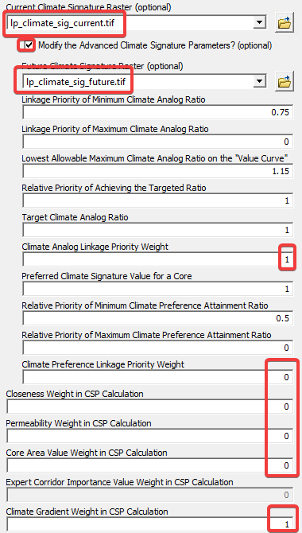

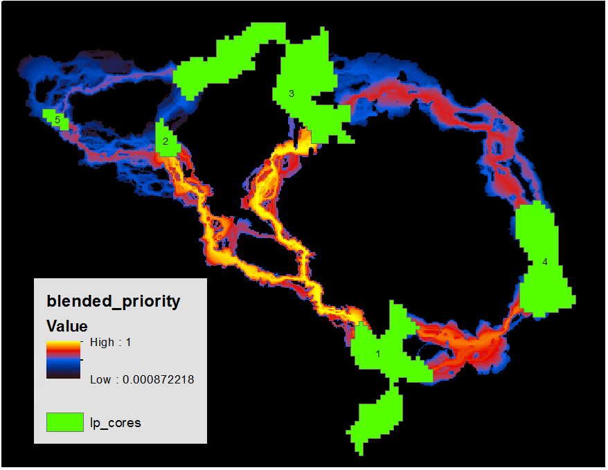

To add in the nuance of climate preference discussed in the white paper,
we’ll open the results window, click on the most recent run, and make a
few changes: giving climate preference the weight of 0.33 as per the
default parameters, and using the climate signature value of the coolest
core, core 5 (329, see the Pro tip, above) as the preferred value of a
core, all else being equal.

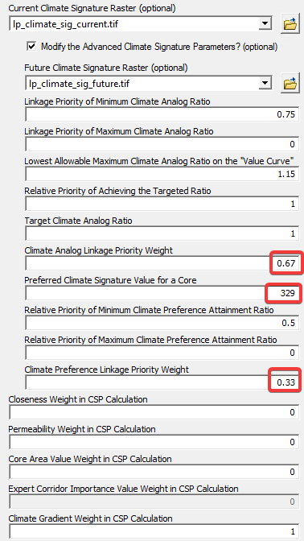

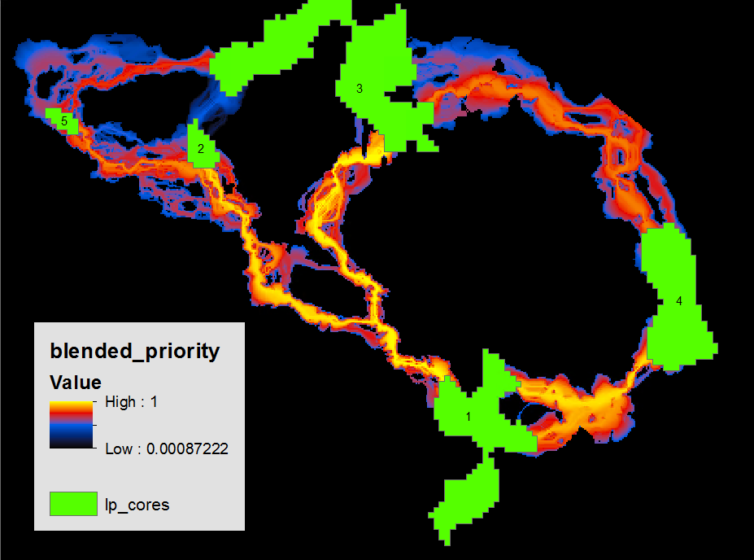

Compared to the previous run, this gives linkages that end in a cooler
core a higher priority, all else being equal. See for example how
linkage 2-5 improves compared to linkage 2-3. It is beyond the scope of
this tutorial at this time to illustrate other aspects of the climate
gradient module. If you would like these, please contact the
corresponding author.

Combine the above sections into a single model run.
---------------------------------------------------

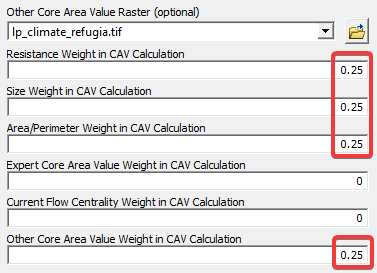

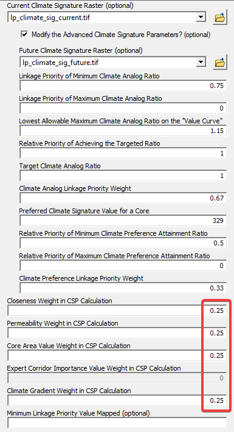

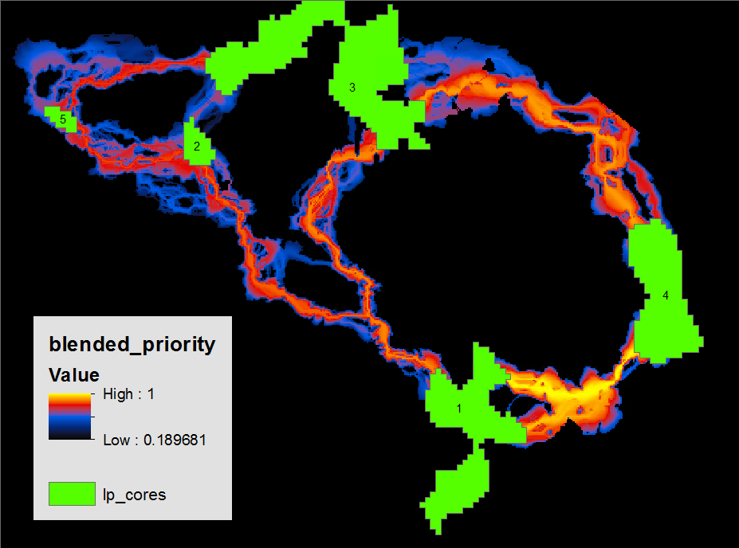

Now, with a much a higher degree of confidence, we can say that given
the data we have, the criteria considered, and the even weights among
them, that the linkage between cores 1 and 4 is the highest prirotity
for investing resources, and the one between 2 and 3 the lowest
priority.

10. .. rubric:: Advanced Linkage Priority Tutorial
       :name: advanced-linkage-priority-tutorial

    1. .. rubric:: Shortcut for Multiple Runs
          :name: shortcut-for-multiple-runs

\*The following is experimental, and a solid understanding of
ModelBuilder is recommended. \*

In most projects it is useful to run multiple iterations of the model to
explore different parameters, and values, and to compare their outputs.
So far, each iteration has been overwriting outputs in the lpv001
folder. The following discusses how to make and store multiple runs, and
how to run both **Build Network and Map Linkages** as well as **Linkage
Priority** tools at the same time, which is especially useful for huge
landscapes, and running both at the same time.

Click “Edit” on one of these tools:

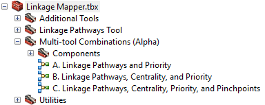

Change the “Project Directory” value to a new name. Run as much of the
model as you can (the first step). Then validate the model. Then edit
any parameter values as necessary. Save, and run the entire model.

Add Centrality
--------------

Another one of LP’s **optional features** for prioritizing corridors is
**core centrality**. This incorporates the outputs of Centrality Mapper
as an input. See the Centrality Mapper user guide for more information
on that tool. To use it here, run Centrality Mapper tool after running
Build Network and Map Linkages, using the same Project Directory. Then,
when using Linkage Priority, give Current Flow Centrality Weight in CAV
Calculation a non-zero value, such as the following (remember, “best
practice” is that all weights add to 1, so note that the Current Flow
Centrality Weight has been adjusted):

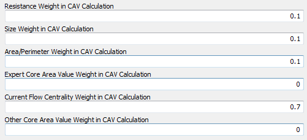

Further, run all other parameters at default values except the
following:

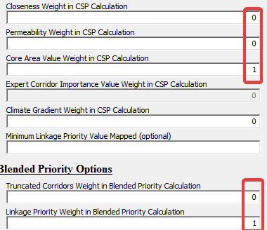

The result should look like the following:

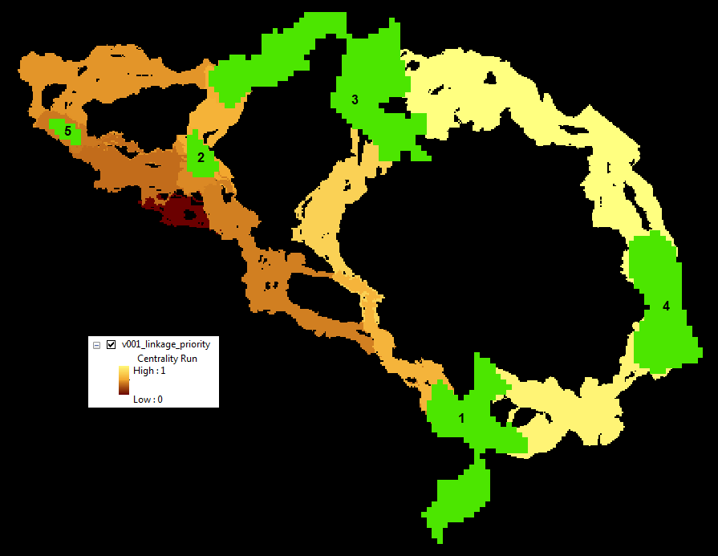

Note that Cores 2 and 3 are more central than Cores 1, 4 and 5. Hence,
linkages that involve these cores have a higher relative priority than
they did on the initial run with default parameters. Note, the
Centrality Mapper Tool iterates through all core pairs. Pinchpoint
Mapper was written after Centrality Mapper, and gives an “all-to-one”
option which is faster on large landscapes and very similar in output.

Inspect Core Area Value Component Calculations
----------------------------------------------

The components of core area value are all calculated in the input Core
Area Feature Class attribute table, as follows:

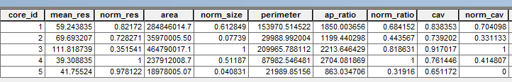

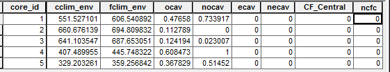

Note that the Expert Core Area Value (ecav) can be specified by editing
this table. All other values will be overwritten on each run of LM/LP.

Export Corridor Importance Value
--------------------------------

Export Corridor Importance Value is a feature that allows you to enter
in relative values for linkages based on expert opinion, or any other
consideration, such as metapopulation dynamics, or a combination of the
two. (When combining, these need to be combined in advance, and the
resulting values are entered in here.)

.. [1]
   This is evolving software with evolving authorship, but we have been
   advised to keep the original preferred citation for tracking
   purposes. John Gallo designed the changes from v2.0 to v3.0, and
   Darren Kavanagh wrote most of the new code.

.. [2]
   from Joe Fargione, Brad McRae's supervisor

.. |<math xmlns="http://www.w3.org/1998/Math/MathML"><msub><mi>C</mi><mrow><mi mathvariant="normal">S</mi><mn>0</mn></mrow></msub></math>| image:: lp/image11.png
   :width: 0.24951in
   :height: 0.20833in

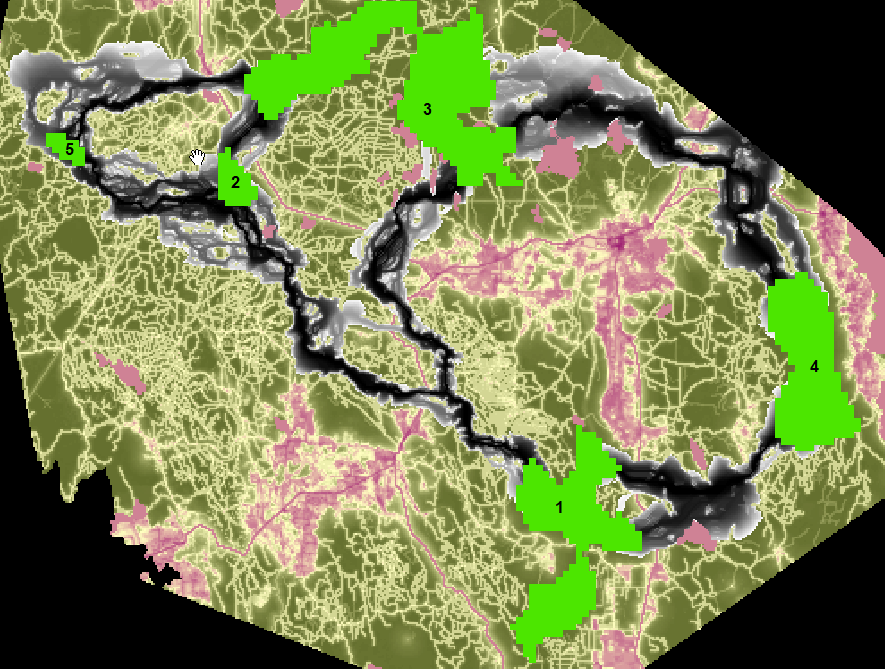

