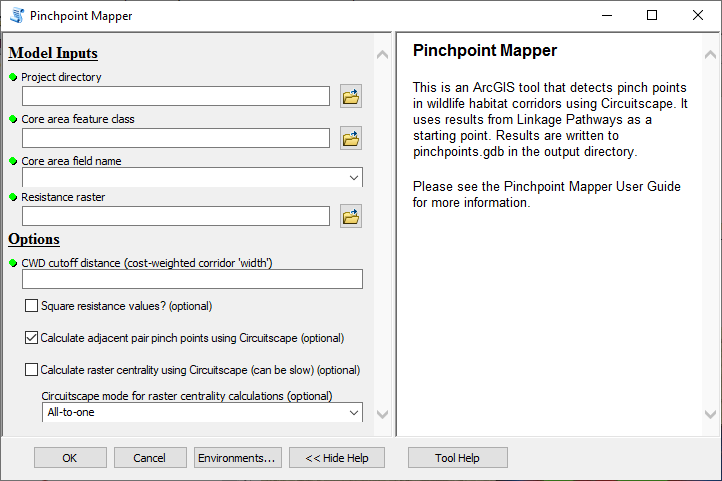
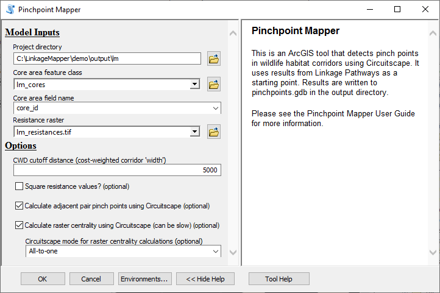
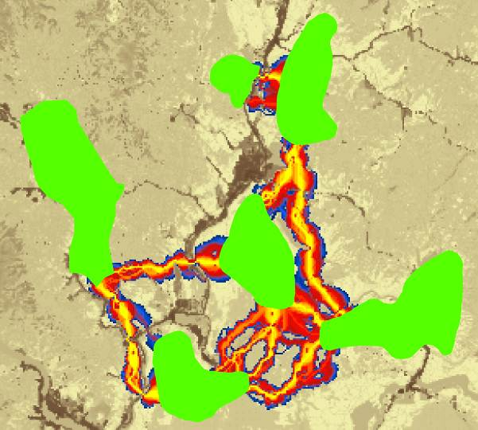
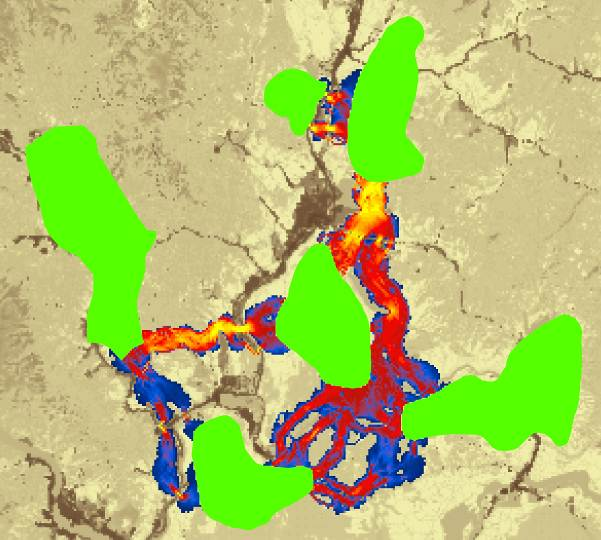

.. _pp:

***********************
Pinchpoint Mapper
***********************

**Pinchpoint Mapper User Guide**

*Version 3.0—Updated July 2021*

Brad McRae

The Nature Conservancy

**Acknowledgements**

Pinchpoint Mapper builds on much of the Python code developed with
**Darren Kavanagh** for Linkage Pathways Tools, and uses Circuitscape,
developed with **Viral Shah.** I am grateful for Darren and Viral’s
excellent contributions.

**Software Requirements and Licensing**

Pinchpoint Mapper requires **ArcGIS Desktop** (10.3 or greater) or
**ArcGIS Pro,** with the **ArcGIS Spatial Analyst** extension.
**Circuitscape 4** must also be installed on your machine. This software
is provided free of charge and is licensed under a GNU General Public
License.

**Preferred Citation**

McRae, B.H. 2012. Pinchpoint Mapper Connectivity Analysis Software. The
Nature Conservancy, Seattle WA. Available at:
https://circuitscape.org/linkagemapper.

**Table of Contents**

`1 Introduction 2 <#introduction>`__

`2 Installation 2 <#installation>`__

`3 Using Pinchpoint Mapper 3 <#using-pinchpoint-mapper>`__

`3.1 Input data requirements 3 <#input-data-requirements>`__

`3.2 Running the toolbox 3 <#running-the-toolbox>`__

`3.3 What Pinchpoint Mapper does 4 <#what-pinchpoint-mapper-does>`__

`4 Pinchpoint Mapper tutorial 5 <#pinchpoint-mapper-tutorial>`__

`5 Community 7 <#community>`__

`6 Literature cited 7 <#literature-cited>`__

Introduction
============

Pinchpoint Mapper is part of the Linkage Mapper toolbox, which includes
the Linkage Pathways Tool (McRae and Kavanagh 2011) and other modules
designed to support regional wildlife habitat connectivity analyses.
Once corridors have been mapped using the Linkage Pathways Tool,
Pinchpoint Mapper runs Circuitscape (McRae and Shah 2009) within the
resulting corridors. This produces current maps that identify and map
pinch points (i.e. constrictions, a.k.a. bottlenecks or choke points) in
least-cost corridors. It also provides corridor effective resistance
values, a measure of connectivity that complements least-cost distances.

More details on the theory behind this approach and on Circuitscape
software can be found in McRae et al. (2008) and McRae and Shah (2009)
respectively.

|image1|\ Figure 1. Example of how Pinchpoint Mapper can be used to
identify and prioritize important areas for connectivity conservation.
(A) Simple landscape, with two patches to be connected (green) separated
by a matrix with varying resistance to dispersal (low resistance in
white, higher resistance in darker shades, and complete barriers in
black). (B) Least-cost corridor between the patches (lowest resistance
routes in yellow, highest in blue). (C) Current flow between the same
two patches derived using Circuitscape, with highest current densities
shown in yellow (from McRae et al. 2008). Circuit analyses complement
least-cost path results by identifying important alternative pathways
and “pinch points,” where loss of a small area could disproportionately
compromise connectivity. (D) Results from Pinchpoint mapper, which
constrains current flow to the best corridor. This approach hybridizes
least-cost corridor and circuit theory approaches, showing both the most
efficient movement pathways and critical pinch points within them. These
could be prioritized over areas that contribute little to connectivity,
such as the dark blue “corridor to nowhere” at the top right.

Installation
============

**1) Install the latest version of Linkage Mapper**

Follow the instructions in the Linkage Pathways Tool User Guide to
install the toolbox.

**2) Install version 4 of Circuitscape**

Circuitscape 4 can be downloaded from
`circuitscape.org <http://www.circuitscape.org>`__. If you are running
64-bit windows, make sure to install the 64-bit version.

**3) Verify your installation**

You can test the code by running the tutorial below.

Using Pinchpoint Mapper
=======================

Input data requirements
-----------------------

Inputs to Pinchpoint Mapper include 1) the same inputs used in Linkage
Pathways (a core area polygon layer and a resistance raster) and 2)
rasters generated from a completed Linkage Pathways run.

Running the toolbox
-------------------

   |image2|\ *Note: ArcGIS can be finicky about file locks. If you get
   schema lock or permission errors, you may need to close any active
   ArcGIS processes and start fresh without any output files displayed.*

   |image3|\ *Note: Several users have reported that they experience
   fewer ArcGIS Desktop errors when running from ArcCatalog.*\ **We
   therefore suggest you run from ArcCatalog if you are having problems
   with ArcMap.**

Click on the *Pinchpoint Mapper* tool, which is located in the
*Additional Tools* toolset in the *Linkage Mapper* toolbox. The
following dialog should appear.

Figure 2. Pinchpoint Mapper dialog in ArcGIS Desktop.

A. **Input data**

   a. **Project directory:** Use the same project directory used for the
      Linkage Pathways run.

   b. **Core area feature class:** Use the same core area file you used
      to create corridors using Linkage Pathways.

   c. **Core area field name:** Use the same core area field name you
      used to create corridors using Linkage Pathways.

   d. **Resistance raster:** Use the same resistance raster used to
      create corridors using Linkage Pathways.

B. **Options**

   a. **CWD cutoff distance:** This is how 'wide' corridors should be in
      cost-weighted distance. See the description of *Linkage Mapping
      Cutoff* in Chapter 2 of WHCWG (2010). Corridors will be
      'cookie-cut' using this cutoff value.

   b. **Square resistance values:** Some practitioners use higher
      resistance values for Circuitscape than for least-cost corridor
      analyses. Squaring values is an easy way to accomplish this
      (though there is no empirical support either way for doing so).

..

   |image4|\ *Note: for processing efficiency in Circuitscape, we
   recommend that the highest resistance values do not exceed 10,000
   times the lowest values.*

c. **Calculate adjacent pair pinch points using Circuitscape:** Run
   current through individual corridors connecting adjacent core areas
   as mapped by Linkage Pathways. Current will be limited to areas below
   the CWD cutoff distance in each corridor. Current values will be
   mosaicked across all corridors.

d. **Calculate raster centrality using Circuitscape:** Runs current
   between all core areas in network. The resistance map will be
   'cookie-cut' to the corridor map produced by Linkage Pathways, and
   will only include areas below the CWD cutoff distance.

e. **Circuitscape mode for raster centrality calculations:** Pairwise
   mode will run current between all pairs of core areas. All-to-one
   mode will tie one core area to ground and inject current into the
   remaining cores, iterating across all cores. Current will then flow
   through these areas between all connected core areas. Results for
   each pair of core areas (pairwise mode) or each core area (all-to-one
   mode) will be summed in the output current map. Both outputs show
   areas that have high current flow centrality, indicating their
   importance for keeping the entire network connected (see McRae et al.
   2008, Carroll et al. 2012). Pairwise mode provides a more intuitive
   centrality measure, but all-to-one mode is faster if you have many
   core areas. See Circuitscape User Guide for more details on these
   modes.

What Pinchpoint Mapper does
---------------------------

Pinchpoint Mapper calls Circuitscape in pairwise and/or all-to one mode.
Pairwise mode will be applied for the adjacent pair pinch points option
and for raster centrality calculations if pairwise mode is chosen.
All-to-one mode will be applied for raster centrality calculations if
all-to-one mode is chosen.

Outputs rasters will be written to pinchpoints.gdb in your output
directory. If adjacent pair pinch points are run, stick and LCP maps in
link_maps.gdb will be updated with effective resistance values (see
McRae and Shah 2009) and cwd-to-effective-resistance ratios. Output
rasters are named using the following convention:

<Project directory name>_current_<mode>_<cutoff value>_<nodata option>

*Mode* indicates the run setting, and includes adjacentPairs, allPairs,
and allToOne. *Cutoff value* is the CWD cutoff value used as the
corridor width. *Nodata option* indicates whether core areas have been
set to NoData in the output raster (which can help with color ramping
your current maps). For raster centrality analyses, maps with and
without the NoData option are automatically produced.

Pinchpoint Mapper tutorial 
==========================

After running the Linkage Pathways tutorial, you can analyze pinch
points in your output corridors. Open up LM_demo_results.mxd, and run
Pinchpoint Mapper using the following settings (substitute the path to
your own demo directory). I recommend experimenting with different CWD
cutoff distance values to get a feel for how they affect results, and
trying the pairwise setting for raster centrality calculations.

Figure 3. Tutorial settings. If applicable, substitute the input for the
*Project Directory* parameter with the path to your demo project
directory.

Figure 4. Above left are corridors from Linkage Pathways tutorial.
Corridors have been clipped to a 5 km cost-weighted ‘width’ cutoff using
**Clip Corridors to Cutoff Width** tool in the Linkage Mapper Utilities
toolset. Right: adjacent pair current maps using 5 km CWD cutoff
distance. Areas with high current values (yellow) indicate pinch points
within individual corridors. Current densities were symbolized in ArcMap
using a quantile classification.

Figure 5. Above left: results from raster centrality analyses using
pairwise mode with 5 km CWD cutoff. This shows areas that have high
current flow centrality, indicating their importance for keeping the
entire network connected (as opposed to keeping a single core area
pair connected as in Fig. 4; see McRae et al. 2008, Carroll et al.
2012). Right: raster centrality results using all-to-one mode.
Results bear a strong resemblance to pairwise results, but all-to-one
can be much faster when there are large numbers of core areas.

*
*

Community
=========

Please join the Linkage Mapper Google Groups forum at
https://groups.google.com/g/linkage-mapper to get updates, report bugs,
and suggest enhancements. Please also visit the project website at
https://circuitscape.org/linkagemapper/.

To contribute to the development of Linkage Mapper explore our code
repository on GitHub: https://github.com/linkagescape/linkage-mapper.

Literature cited
================

Carroll, C., B.H. McRae, and A. Brookes. 2012. Use of linkage mapping
and centrality analysis across habitat gradients to conserve
connectivity of gray wolf populations in western North America.
Conservation Biology 26(1):78-87.

McRae, B.H., B.G. Dickson, T.H. Keitt, and V.B. Shah. 2008. Using
circuit theory to model connectivity in ecology, evolution, and
conservation. *Ecology* 10: 2712-2724.

McRae, B.H., and Shah, V.B. 2009. Circuitscape User’s Guide. ONLINE. The
University of California, Santa Barbara. Available at:
https://circuitscape.org.

Washington Wildlife Habitat Connectivity Working Group (WHCWG). 2010.
*Washington Connected Landscapes Project: Statewide Analysis.*
Washington Departments of Fish and Wildlife, and Transportation,
Olympia, WA. Available at: https://www.waconnected.org.

.. |image1| image:: pp/image1.png
   :width: 4.06458in
   :height: 4in
.. |image2| image:: pp/image2.jpeg
   :width: 0.3125in
   :height: 0.32292in
.. |image3| image:: pp/image3.jpeg
   :width: 0.47014in
   :height: 0.47153in
.. |image4| image:: pp/image2.jpeg
   :width: 0.3125in
   :height: 0.32292in
